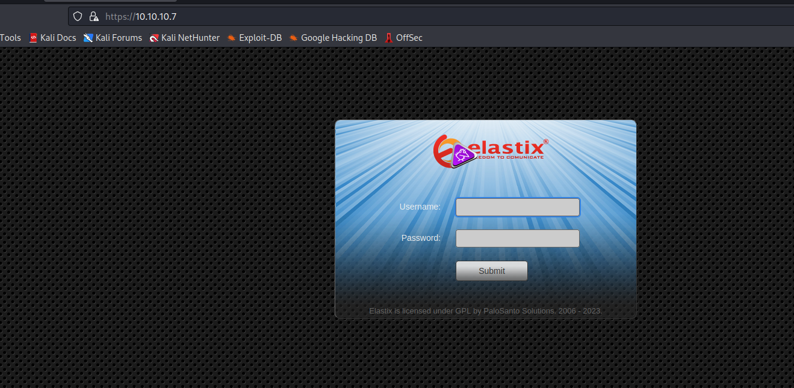
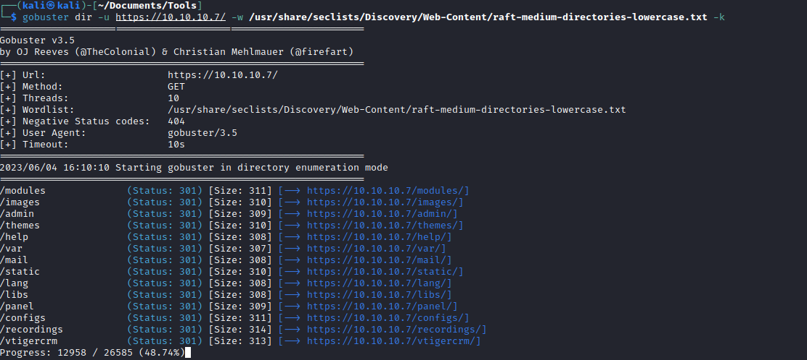
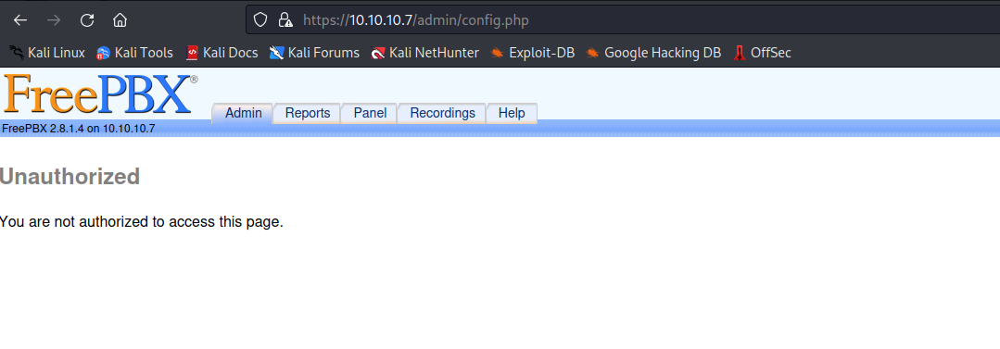
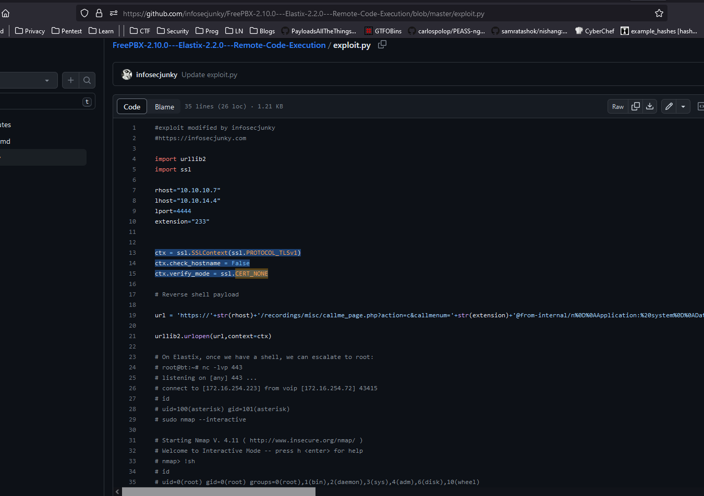
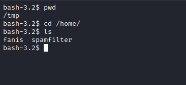
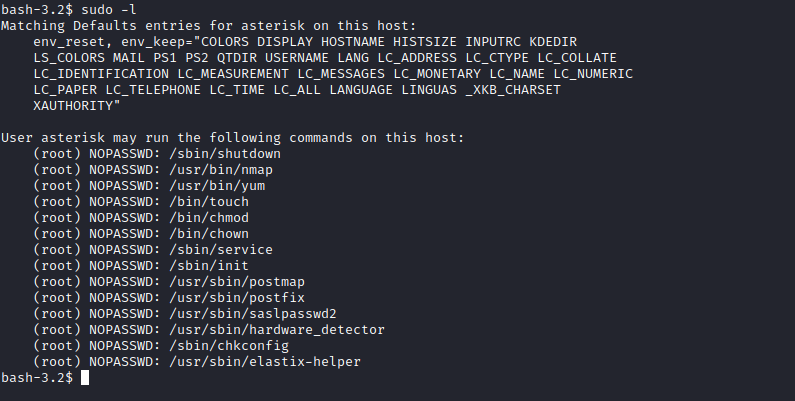
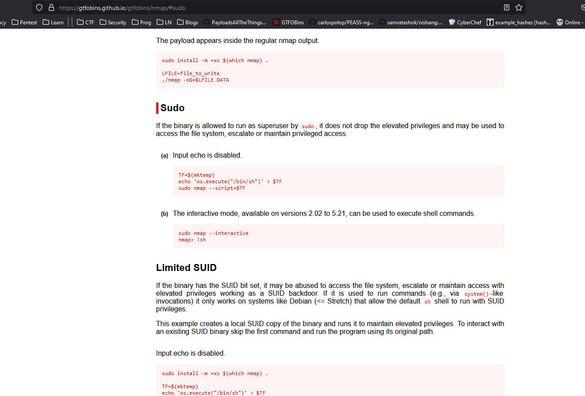

# Beep
## Enumeration
- ```Nmap```
```
┌──(kali㉿kali)-[~]
└─$ nmap -sC -sV 10.10.10.7                              
Starting Nmap 7.93 ( https://nmap.org ) at 2023-06-03 14:45 BST
Nmap scan report for 10.10.10.7 (10.10.10.7)
Host is up (0.14s latency).
Not shown: 984 closed tcp ports (conn-refused)
PORT      STATE    SERVICE        VERSION
22/tcp    open     ssh            OpenSSH 4.3 (protocol 2.0)
| ssh-hostkey: 
|   1024 adee5abb6937fb27afb83072a0f96f53 (DSA)
|_  2048 bcc6735913a18a4b550750f6651d6d0d (RSA)
25/tcp    open     smtp           Postfix smtpd
|_smtp-commands: beep.localdomain, PIPELINING, SIZE 10240000, VRFY, ETRN, ENHANCEDSTATUSCODES, 8BITMIME, DSN
80/tcp    open     http           Apache httpd 2.2.3
|_http-title: Did not follow redirect to https://10.10.10.7/
|_http-server-header: Apache/2.2.3 (CentOS)
110/tcp   open     pop3           Cyrus pop3d 2.3.7-Invoca-RPM-2.3.7-7.el5_6.4
|_pop3-capabilities: TOP LOGIN-DELAY(0) EXPIRE(NEVER) RESP-CODES STLS PIPELINING APOP IMPLEMENTATION(Cyrus POP3 server v2) USER AUTH-RESP-CODE UIDL
111/tcp   open     rpcbind        2 (RPC #100000)
| rpcinfo: 
|   program version    port/proto  service
|   100000  2            111/tcp   rpcbind
|   100000  2            111/udp   rpcbind
|   100024  1            875/udp   status
|_  100024  1            878/tcp   status
143/tcp   open     imap           Cyrus imapd 2.3.7-Invoca-RPM-2.3.7-7.el5_6.4
|_imap-capabilities: ID STARTTLS BINARY MULTIAPPEND Completed IDLE OK QUOTA URLAUTHA0001 X-NETSCAPE THREAD=REFERENCES NO LITERAL+ CHILDREN LISTEXT CONDSTORE ATOMIC CATENATE MAILBOX-REFERRALS RENAME SORT=MODSEQ THREAD=ORDEREDSUBJECT IMAP4rev1 LIST-SUBSCRIBED UNSELECT ACL SORT ANNOTATEMORE UIDPLUS NAMESPACE RIGHTS=kxte IMAP4
443/tcp   open     ssl/http       Apache httpd 2.2.3 ((CentOS))
|_http-server-header: Apache/2.2.3 (CentOS)
| http-robots.txt: 1 disallowed entry 
|_/
| ssl-cert: Subject: commonName=localhost.localdomain/organizationName=SomeOrganization/stateOrProvinceName=SomeState/countryName=--
| Not valid before: 2017-04-07T08:22:08
|_Not valid after:  2018-04-07T08:22:08
|_ssl-date: 2023-06-03T13:48:55+00:00; -28s from scanner time.
|_http-title: Elastix - Login page
993/tcp   open     ssl/imap       Cyrus imapd
|_imap-capabilities: CAPABILITY
995/tcp   open     pop3           Cyrus pop3d
2002/tcp  filtered globe
3306/tcp  open     mysql          MySQL (unauthorized)
4445/tcp  open     upnotifyp?
7070/tcp  filtered realserver
7625/tcp  filtered unknown
9091/tcp  filtered xmltec-xmlmail
10000/tcp open     http           MiniServ 1.570 (Webmin httpd)
|_http-title: Site doesn't have a title (text/html; Charset=iso-8859-1).
Service Info: Hosts:  beep.localdomain, 127.0.0.1, example.com

Host script results:
|_clock-skew: -28s

Service detection performed. Please report any incorrect results at https://nmap.org/submit/ .
Nmap done: 1 IP address (1 host up) scanned in 410.61 seconds
```
- Webserver 



- There were too many open ports to check, so I started `gobuster` in the background
  

## Foothold/User
- Right away I got results, and found `admin` endpoint
  - Where we can wee the version of the application



- Found a exploit in `exploit-db` 
  - Same results can be achieved using `searchsploit`


- Well, I tried using `searchsploit's` exploit
  - But no success
  - Since the box is old, I thought maybe there were some version inconsistencies related to libraries, which then happened to be `SSL`
  - Then I found updated version of [exploit](https://github.com/infosecjunky/FreePBX-2.10.0---Elastix-2.2.0---Remote-Code-Execution/blob/master/exploit.py)



- Let's run it and get a shell




## Root
- The first thing I always check is `sudo` privileges



- We see bunch of `sudo` rights
  - Use [GTFOBins](https://gtfobins.github.io/) and get a root
  - I choose `nmap` as a privesc path




- Check [0xdf](https://0xdf.gitlab.io/2021/02/23/htb-beep.html) for other paths