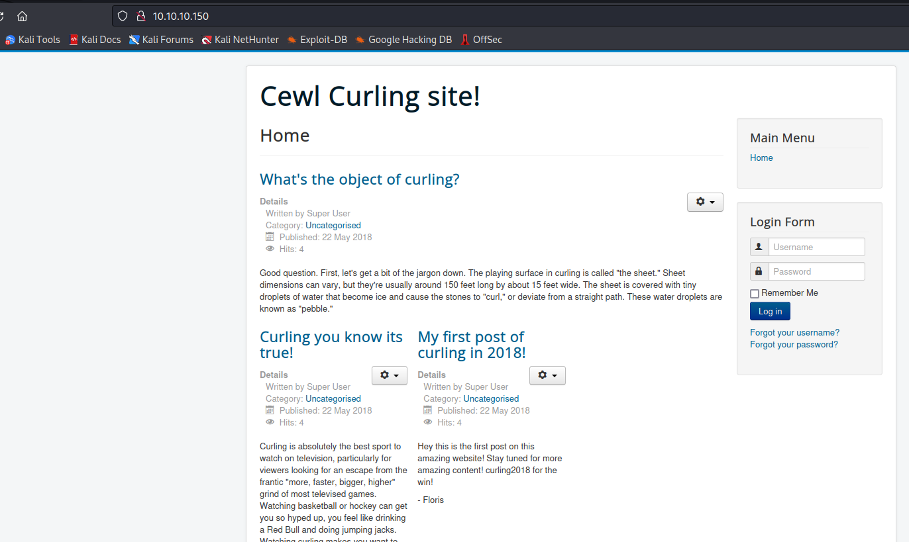
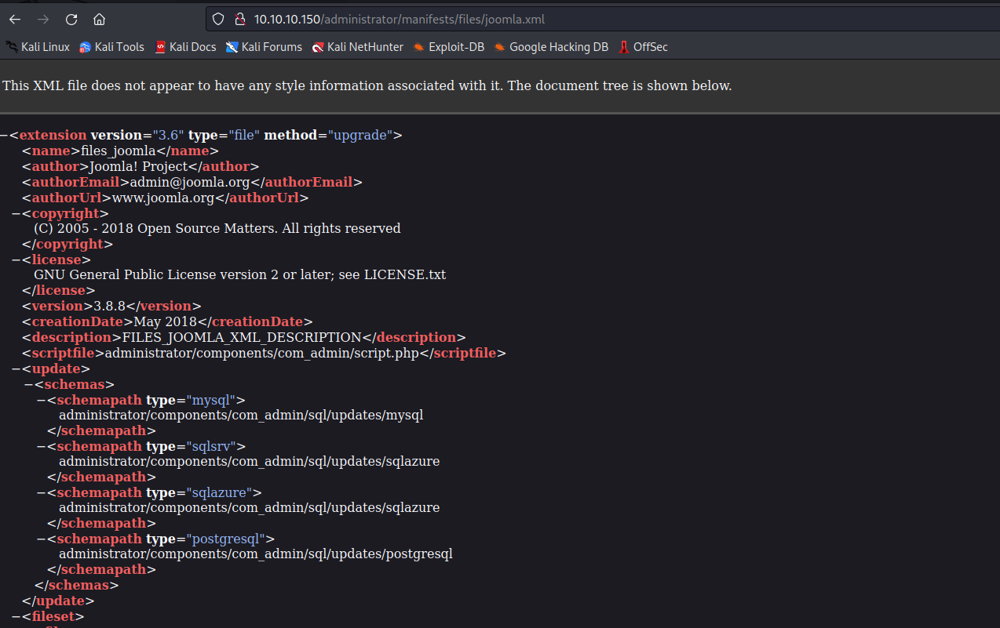
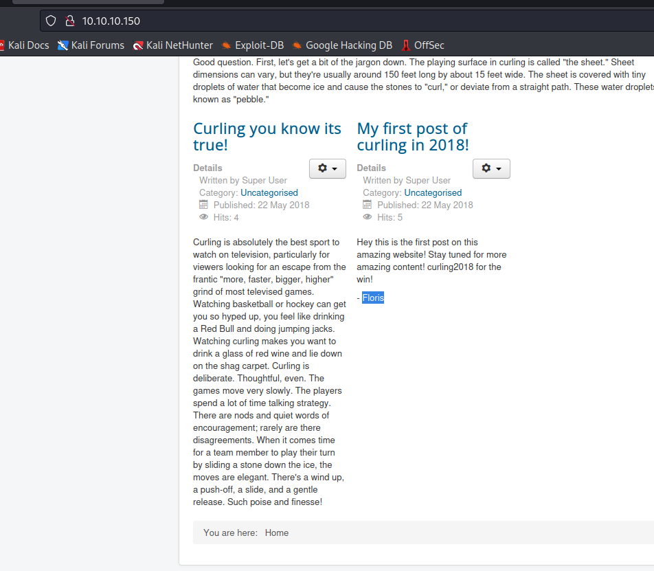
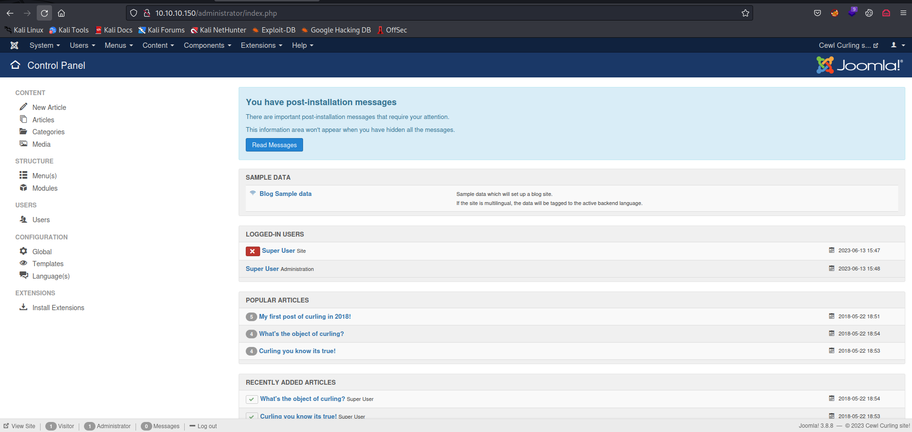
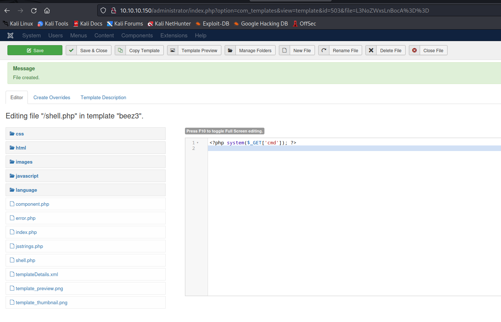
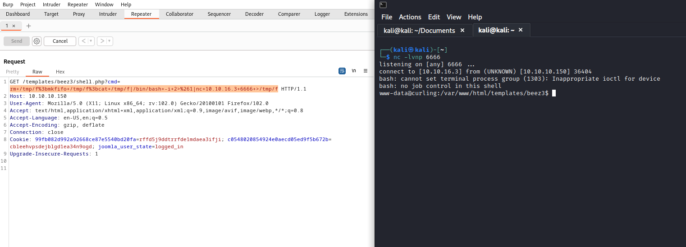
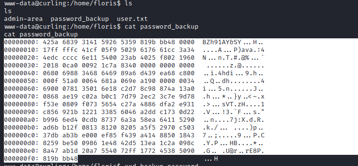
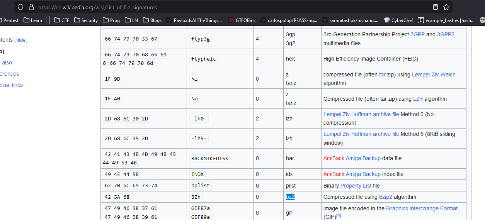
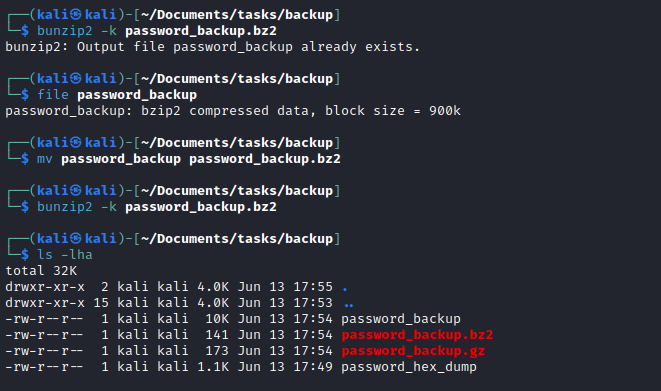

# Curling
## Enumeration
- `nmap`
```
└─$ nmap -sC -sV 10.10.10.150
Starting Nmap 7.93 ( https://nmap.org ) at 2023-06-12 17:50 BST
Nmap scan report for 10.10.10.150 (10.10.10.150)
Host is up (0.18s latency).
Not shown: 998 closed tcp ports (conn-refused)
PORT   STATE SERVICE VERSION
22/tcp open  ssh     OpenSSH 7.6p1 Ubuntu 4ubuntu0.5 (Ubuntu Linux; protocol 2.0)
| ssh-hostkey: 
|   2048 8ad169b490203ea7b65401eb68303aca (RSA)
|   256 9f0bc2b20bad8fa14e0bf63379effb43 (ECDSA)
|_  256 c12a3544300c5b566a3fa5cc6466d9a9 (ED25519)
80/tcp open  http    Apache httpd 2.4.29 ((Ubuntu))
|_http-title: Home
|_http-server-header: Apache/2.4.29 (Ubuntu)
|_http-generator: Joomla! - Open Source Content Management
Service Info: OS: Linux; CPE: cpe:/o:linux:linux_kernel

Service detection performed. Please report any incorrect results at https://nmap.org/submit/ .
Nmap done: 1 IP address (1 host up) scanned in 37.29 seconds
```
- `gobuster`
```
└─$ gobuster dir -u http://10.10.10.150 -w /usr/share/seclists/Discovery/Web-Content/directory-list-2.3-medium.txt -t 50        
===============================================================
Gobuster v3.5
by OJ Reeves (@TheColonial) & Christian Mehlmauer (@firefart)
===============================================================
[+] Url:                     http://10.10.10.150
[+] Method:                  GET
[+] Threads:                 50
[+] Wordlist:                /usr/share/seclists/Discovery/Web-Content/directory-list-2.3-medium.txt
[+] Negative Status codes:   404
[+] User Agent:              gobuster/3.5
[+] Timeout:                 10s
===============================================================
2023/06/12 18:07:47 Starting gobuster in directory enumeration mode
===============================================================
/index.php            (Status: 200) [Size: 14264]
/media                (Status: 301) [Size: 312] [--> http://10.10.10.150/media/]
/templates            (Status: 301) [Size: 316] [--> http://10.10.10.150/templates/]
/modules              (Status: 301) [Size: 314] [--> http://10.10.10.150/modules/]
/.php                 (Status: 403) [Size: 277]
/images               (Status: 301) [Size: 313] [--> http://10.10.10.150/images/]
/bin                  (Status: 301) [Size: 310] [--> http://10.10.10.150/bin/]
/plugins              (Status: 301) [Size: 314] [--> http://10.10.10.150/plugins/]
/includes             (Status: 301) [Size: 315] [--> http://10.10.10.150/includes/]
/language             (Status: 301) [Size: 315] [--> http://10.10.10.150/language/]
/README.txt           (Status: 200) [Size: 4872]
/components           (Status: 301) [Size: 317] [--> http://10.10.10.150/components/]
/cache                (Status: 301) [Size: 312] [--> http://10.10.10.150/cache/]
/libraries            (Status: 301) [Size: 316] [--> http://10.10.10.150/libraries/]
/tmp                  (Status: 301) [Size: 310] [--> http://10.10.10.150/tmp/]
/LICENSE.txt          (Status: 200) [Size: 18092]
/layouts              (Status: 301) [Size: 314] [--> http://10.10.10.150/layouts/]
/secret.txt           (Status: 200) [Size: 17]
/administrator        (Status: 301) [Size: 320] [--> http://10.10.10.150/administrator/]
/configuration.php    (Status: 200) [Size: 0]
/htaccess.txt         (Status: 200) [Size: 3005]
/cli                  (Status: 301) [Size: 310] [--> http://10.10.10.150/cli/]
Progress: 220515 / 220561 (99.98%)
===============================================================
2023/06/12 18:16:06 Finished
===============================================================

```
- Web server
  


- Joomla


- And let's find `joomla` version



## Foothold
- Let's check `secret.txt` returned by `gobuster`
  - Probably a `password`


- We see the possible `username`



- Try creds to enter the `administrator` page



- We can create a new `php` file and use it to launch a `reverse shell`
  - Let's create it in `templates` page
  - And we get our `rce`




- Set up a listener an send your `reverse shell` payload
  - We got our foothold



## User
- Let's check `floris` home folder
  - We see `password_backup` file
  - Which looks like a `bz2` archive




- I uploaded archive to my vm
  - And converted it back to binary using `xxd`
  - Then decompressed using `bunzip2`, which result in `gzip` file
  - Repeat decompressing until we get `password.txt`





- Use password to `ssh` or `su` as `floris`


## Root
- Enumerate for privesc
  - `linpeas` and `pspy64`
  - We see an automated process/job running


- The job inputs config file to `curl` via `-K` option: `Specify a text file to read curl arguments from. The command line arguments found in the text file will be used as if they were provided on the command line.`
  - So we can try modifying `input` file and read our flag
  - Or we can add `floris` to `sudoers` by overwriting original `sudoers` file on the machine
  - Create `sudoers` file on our box and deploy `http` server
  - Modify `input` file to download and replace `sudoers` file


- Wait for job to complete and run `sudo su`


- `Useful`: You can watch the modification of file with `watch` command 
  - `watch -n 1 cat report`


- Wait for the task and then `sudo su`
  - We are root


