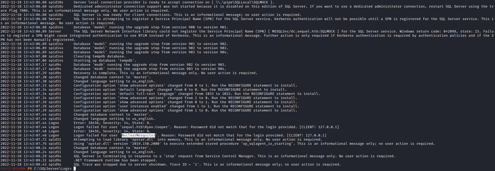
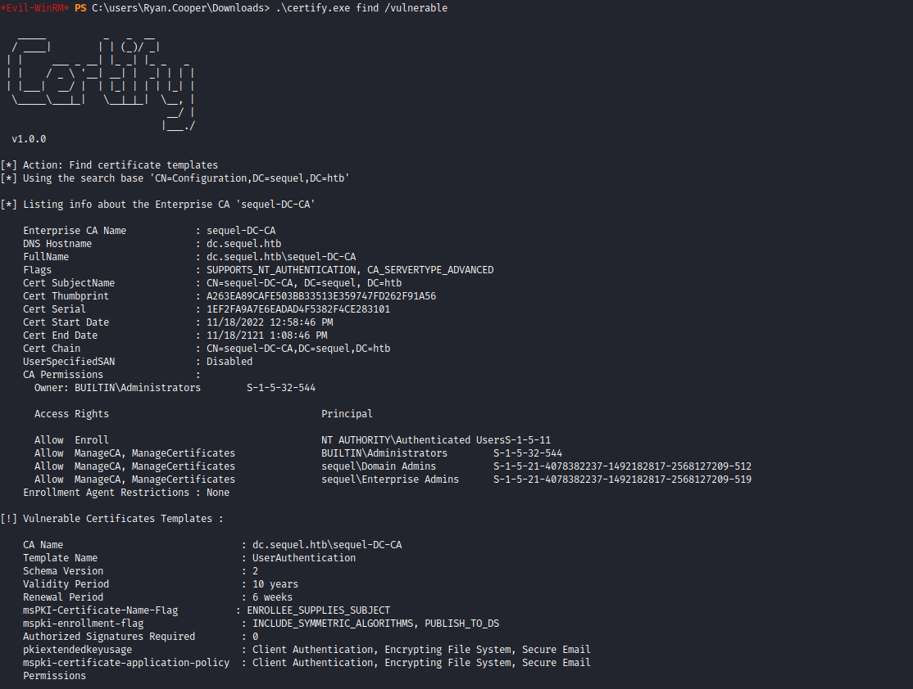
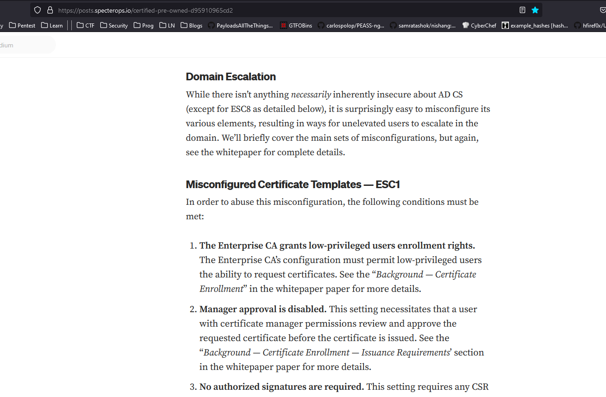
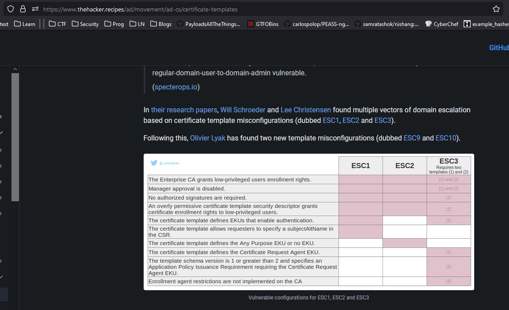
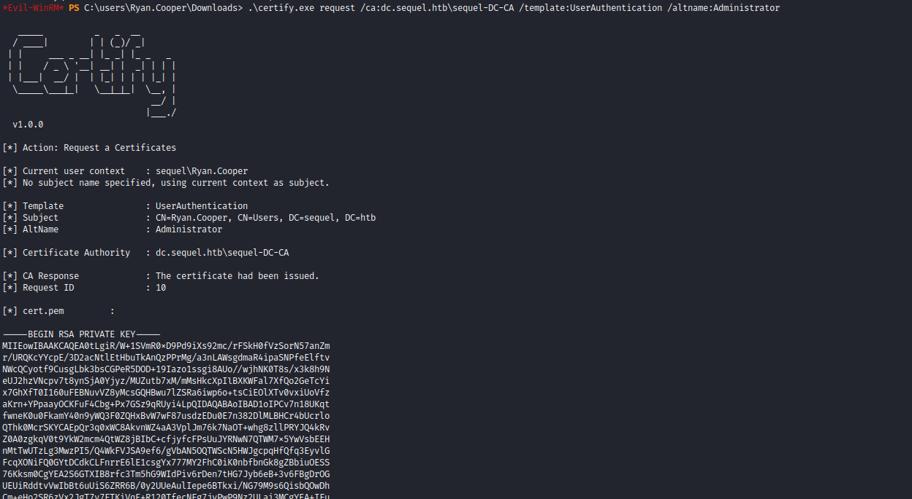
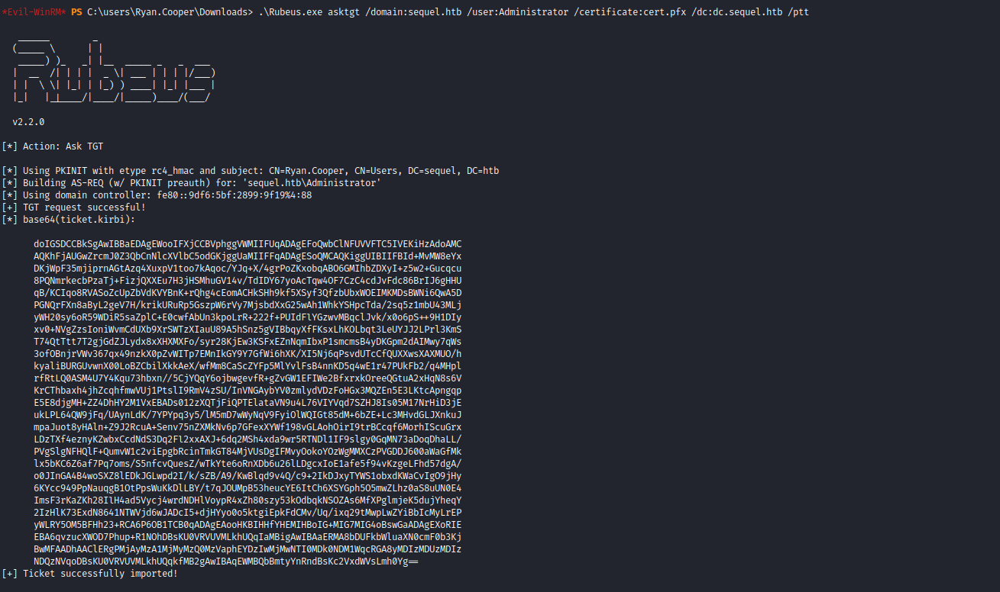
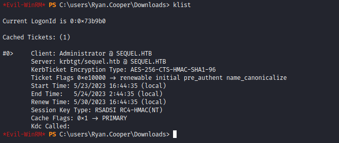

# Escape
## Enumeration
- `nmap`
```
┌──(kali㉿kali)-[~]
└─$ nmap -Pn -p53,88,135,139,389,445,464,593,636,1433,3268,3269,5985,9389,4966,49689,49690,49706,49714,58597 10.10.11.202 -T4 -sC -sV
Starting Nmap 7.93 ( https://nmap.org ) at 2023-05-21 09:24 EDT
Nmap scan report for 10.10.11.202 (10.10.11.202)
Host is up (0.16s latency).

PORT      STATE    SERVICE       VERSION
53/tcp    open     domain        Simple DNS Plus
88/tcp    open     kerberos-sec  Microsoft Windows Kerberos (server time: 2023-05-21 21:24:13Z)
135/tcp   open     msrpc         Microsoft Windows RPC
139/tcp   open     netbios-ssn   Microsoft Windows netbios-ssn
389/tcp   open     ldap          Microsoft Windows Active Directory LDAP (Domain: sequel.htb0., Site: Default-First-Site-Name)
|_ssl-date: 2023-05-21T21:25:47+00:00; +7h59m35s from scanner time.
| ssl-cert: Subject: commonName=dc.sequel.htb
| Subject Alternative Name: othername: 1.3.6.1.4.1.311.25.1::<unsupported>, DNS:dc.sequel.htb
| Not valid before: 2022-11-18T21:20:35
|_Not valid after:  2023-11-18T21:20:35
445/tcp   open     microsoft-ds?
464/tcp   open     kpasswd5?
593/tcp   open     ncacn_http    Microsoft Windows RPC over HTTP 1.0
636/tcp   open     ssl/ldap      Microsoft Windows Active Directory LDAP (Domain: sequel.htb0., Site: Default-First-Site-Name)
| ssl-cert: Subject: commonName=dc.sequel.htb
| Subject Alternative Name: othername: 1.3.6.1.4.1.311.25.1::<unsupported>, DNS:dc.sequel.htb
| Not valid before: 2022-11-18T21:20:35
|_Not valid after:  2023-11-18T21:20:35
|_ssl-date: 2023-05-21T21:25:47+00:00; +7h59m35s from scanner time.
1433/tcp  open     ms-sql-s      Microsoft SQL Server 2019 15.00.2000.00; RTM
|_ssl-date: 2023-05-21T21:25:46+00:00; +7h59m36s from scanner time.
| ms-sql-ntlm-info: 
|   10.10.11.202:1433: 
|     Target_Name: sequel
|     NetBIOS_Domain_Name: sequel
|     NetBIOS_Computer_Name: DC
|     DNS_Domain_Name: sequel.htb
|     DNS_Computer_Name: dc.sequel.htb
|     DNS_Tree_Name: sequel.htb
|_    Product_Version: 10.0.17763
| ssl-cert: Subject: commonName=SSL_Self_Signed_Fallback
| Not valid before: 2023-05-19T20:14:37
|_Not valid after:  2053-05-19T20:14:37
| ms-sql-info: 
|   10.10.11.202:1433: 
|     Version: 
|       name: Microsoft SQL Server 2019 RTM
|       number: 15.00.2000.00
|       Product: Microsoft SQL Server 2019
|       Service pack level: RTM
|       Post-SP patches applied: false
|_    TCP port: 1433
3268/tcp  open     ldap          Microsoft Windows Active Directory LDAP (Domain: sequel.htb0., Site: Default-First-Site-Name)
|_ssl-date: 2023-05-21T21:25:47+00:00; +7h59m35s from scanner time.
| ssl-cert: Subject: commonName=dc.sequel.htb
| Subject Alternative Name: othername: 1.3.6.1.4.1.311.25.1::<unsupported>, DNS:dc.sequel.htb
| Not valid before: 2022-11-18T21:20:35
|_Not valid after:  2023-11-18T21:20:35
3269/tcp  open     ssl/ldap      Microsoft Windows Active Directory LDAP (Domain: sequel.htb0., Site: Default-First-Site-Name)
| ssl-cert: Subject: commonName=dc.sequel.htb
| Subject Alternative Name: othername: 1.3.6.1.4.1.311.25.1::<unsupported>, DNS:dc.sequel.htb
| Not valid before: 2022-11-18T21:20:35
|_Not valid after:  2023-11-18T21:20:35
|_ssl-date: 2023-05-21T21:25:47+00:00; +7h59m36s from scanner time.
4966/tcp  filtered unknown
5985/tcp  open     http          Microsoft HTTPAPI httpd 2.0 (SSDP/UPnP)
|_http-title: Not Found
|_http-server-header: Microsoft-HTTPAPI/2.0
9389/tcp  open     mc-nmf        .NET Message Framing
49689/tcp open     ncacn_http    Microsoft Windows RPC over HTTP 1.0
49690/tcp open     msrpc         Microsoft Windows RPC
49706/tcp open     msrpc         Microsoft Windows RPC
49714/tcp open     msrpc         Microsoft Windows RPC
58597/tcp open     msrpc         Microsoft Windows RPC
Service Info: Host: DC; OS: Windows; CPE: cpe:/o:microsoft:windows

Host script results:
| smb2-security-mode: 
|   311: 
|_    Message signing enabled and required
| smb2-time: 
|   date: 2023-05-21T21:25:07
|_  start_date: N/A
|_clock-skew: mean: 7h59m35s, deviation: 0s, median: 7h59m34s

Service detection performed. Please report any incorrect results at https://nmap.org/submit/ .
Nmap done: 1 IP address (1 host up) scanned in 102.84 seconds
```
- `smb`


- We see a pdf file
  - We have the creds in `Bonus` section


## Foothold
- Let's check creds from pdf
  - We have an access


- So I connected to `SQL` and tried enumerating it using the `hacktricks` checklist
  - Checked `sql_users`
  - Checked `linked_servers`


- Then I noticed I got to the part with `NTLM` and `Relay attacks`


- Let's try stealing hash
  - And we get `sql_svc`'s hash


- Let's crack it


- Use `evil-winrm` to connect to `box`


## User
- I spent a significant time enumerating the box to get a user
  - I noticed a `SQLServer` logs
  - Where we can find user creds




- Now we get our user

## Root
- During enumeration, I noticed user certificates pop up in user's object
  - Moreover the name of the box is `Escape`, so I thought it could be related to `ESC` attacks targeting `ADCS`


- So let's upload `certify` and run it to find vulnerable certificate templates
  - Okay, we find one



- Let's google a bit to find a suitable attack




- Let's request a certificate, since we have a `UserAuthentification`



- Now, we need to convert it to `pfx`


- Now we can upload `pfx` to box and use `Rubeus` for `ptt` attack
  - [SharpCollection](https://github.com/Flangvik/SharpCollection) to download `Rubeus`
  - Let's check `tgt`
  - We're adminstrator




- However I could enter Administrator's folders
  - It looks like it doesn't work with `evil-winrm`
  - So I was able to access them using alternative way with `certipy`
  - Notice that I sync my time with the time of the `box`


- Note: Looks like there was a way to do dump the hashes from `evil-winrm`
  - `.\Rubeus.exe asktgt /user:administrator /certificate:<Certificate> /getcredentials /show /nowrap`
