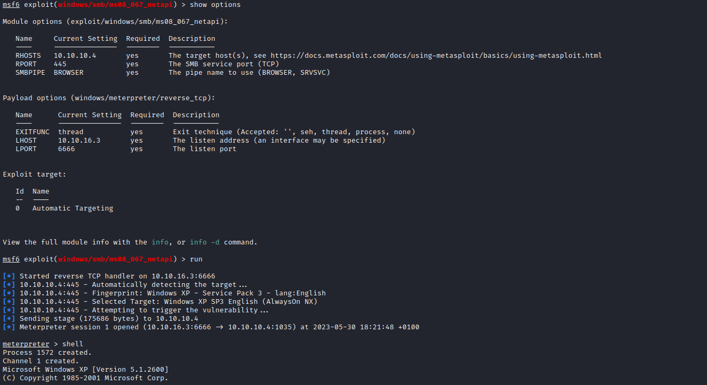

# Legacy
## Enumeration
- ```Nmap```
```
┌──(kali㉿kali)-[~]
└─$ nmap -Pn -sC -sV 10.10.10.4
Starting Nmap 7.93 ( https://nmap.org ) at 2023-05-30 18:11 BST
Nmap scan report for 10.10.10.4 (10.10.10.4)
Host is up (0.17s latency).
Not shown: 997 closed tcp ports (conn-refused)
PORT    STATE SERVICE      VERSION
135/tcp open  msrpc        Microsoft Windows RPC
139/tcp open  netbios-ssn  Microsoft Windows netbios-ssn
445/tcp open  microsoft-ds Windows XP microsoft-ds
Service Info: OSs: Windows, Windows XP; CPE: cpe:/o:microsoft:windows, cpe:/o:microsoft:windows_xp

Host script results:
|_smb2-time: Protocol negotiation failed (SMB2)
|_clock-skew: mean: 5d00h27m11s, deviation: 2h07m16s, median: 4d22h57m11s
|_nbstat: NetBIOS name: LEGACY, NetBIOS user: <unknown>, NetBIOS MAC: 005056b90f40 (VMware)
| smb-os-discovery: 
|   OS: Windows XP (Windows 2000 LAN Manager)
|   OS CPE: cpe:/o:microsoft:windows_xp::-
|   Computer name: legacy
|   NetBIOS computer name: LEGACY\x00
|   Workgroup: HTB\x00
|_  System time: 2023-06-04T22:09:21+03:00
| smb-security-mode: 
|   account_used: <blank>
|   authentication_level: user
|   challenge_response: supported
|_  message_signing: disabled (dangerous, but default)

Service detection performed. Please report any incorrect results at https://nmap.org/submit/ .
Nmap done: 1 IP address (1 host up) scanned in 62.71 seconds
```
- ```Nmap vulnerability scripts```
```
┌──(kali㉿kali)-[~]
└─$ nmap -Pn -p139,445,135 --script *vuln* 10.10.10.4
Starting Nmap 7.93 ( https://nmap.org ) at 2023-05-30 18:17 BST
Nmap scan report for 10.10.10.4 (10.10.10.4)
Host is up (0.11s latency).

PORT    STATE SERVICE
135/tcp open  msrpc
139/tcp open  netbios-ssn
445/tcp open  microsoft-ds

Host script results:
|_smb-vuln-ms10-061: ERROR: Script execution failed (use -d to debug)
| smb-vuln-ms08-067: 
|   VULNERABLE:
|   Microsoft Windows system vulnerable to remote code execution (MS08-067)
|     State: VULNERABLE
|     IDs:  CVE:CVE-2008-4250
|           The Server service in Microsoft Windows 2000 SP4, XP SP2 and SP3, Server 2003 SP1 and SP2,
|           Vista Gold and SP1, Server 2008, and 7 Pre-Beta allows remote attackers to execute arbitrary
|           code via a crafted RPC request that triggers the overflow during path canonicalization.
|           
|     Disclosure date: 2008-10-23
|     References:
|       https://cve.mitre.org/cgi-bin/cvename.cgi?name=CVE-2008-4250
|_      https://technet.microsoft.com/en-us/library/security/ms08-067.aspx
| smb-vuln-ms17-010: 
|   VULNERABLE:
|   Remote Code Execution vulnerability in Microsoft SMBv1 servers (ms17-010)
|     State: VULNERABLE
|     IDs:  CVE:CVE-2017-0143
|     Risk factor: HIGH
|       A critical remote code execution vulnerability exists in Microsoft SMBv1
|        servers (ms17-010).
|           
|     Disclosure date: 2017-03-14
|     References:
|       https://cve.mitre.org/cgi-bin/cvename.cgi?name=CVE-2017-0143
|       https://blogs.technet.microsoft.com/msrc/2017/05/12/customer-guidance-for-wannacrypt-attacks/
|_      https://technet.microsoft.com/en-us/library/security/ms17-010.aspx
|_samba-vuln-cve-2012-1182: NT_STATUS_ACCESS_DENIED
|_smb-vuln-ms10-054: false

Nmap done: 1 IP address (1 host up) scanned in 29.43 seconds
```
- Right away it states that it's vulnerable to [MS08-067](https://learn.microsoft.com/en-us/security-updates/securitybulletins/2008/ms08-067)
  - https://www.exploit-db.com/exploits/7104


## Root
- Let's run metasploit and execute an exploit
  - I was lazy to search for a Github exploit



- And we have an access as `LEGACY$` machine account 


